---
## Author
author:
  name: Чистов Даниил Максимович
  degrees: DSc
  orcid: 0000-0002-0877-7063
  email: 1132236021@rudn.ru
  affiliation:
    - name: Российский университет дружбы народов
      country: Российская Федерация
      postal-code: 117198
      city: Москва
      address: ул. Миклухо-Маклая, д. 6
### Title
title: Лабораторная работа №2
subtitle: Имитационное моделирование
license: CC BY
date: today
date-format: "YYYY-MM-DD" # Example: 2025-09-06
---

## Докладчик

* Чистов Даниил Максимович
* Студент
* Третий курс
* Российский университет дружбы народов им. П. Лумумбы

## Цель работы

Целью данной работы является изучение математических моделей SIR и Лотки–Вольтерры, а также ознакомление с их реализацией в Julia.

## Задание

- Изучить модели SIR и Лотки–Вольтерры
- Создать рабочий каталог для всего курса.
- Создать рабочее пространство для программ в рамках лабораторной работы.
- Установить необходимые пакеты.
- Выполнить предложенный код.
- Преобразовать код в литературный стиль.
- Сгенерировать из литературного кода: чистый код, jupyter notebook, документацию в формате Quarto.
- Выполнить код из jupyter notebook.
- Интегрировать документацию в формате Quarto в отчёт.
- Добавить в код в литературном стиле вычисление для набора параметров.
- Сгенерировать из литературного кода: чистый код, jupyter notebook, документацию в формате Quarto.
- Выполнить код из jupyter notebook.
- Интегрировать документацию в формате Quarto в отчёт.

# Выполнение лабораторной работы

## Подготовительные работы

В папке lab02 инициализирую проект для данной лабораторной работы

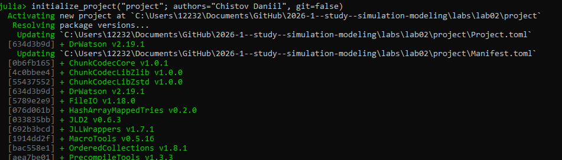{#fig-001 width=70%}

## Подготовительные работы

Устанавливаю необходимые пакеты.

{#fig-002 width=70%}

## Подготовительные работы

Проверяю, что все пакеты скачены.

{#fig-003 width=70%}

# Работа с моделью SIR

Создаю файл sir_ode.jl, запускаю его. Код успешно работает.

{#fig-004 width=70%}

## Работа с моделью SIR

Модель SIR есть классическая и фундаментальная математическая модель эпидемиологии, описывающая распространение инфекционного заболевания в закрытой популяции.

## Ключевая идея

Модель SIR делит всю популяцию на три взаимосвязанные группы (компартменты), что отражено в её названии:

* S — Susceptible (Восприимчивые): люди, которые не болели, не имеют иммунитета и могут заразиться.
* I — Infectious (Инфицированные/Заразные): люди, которые в данный момент больны и могут передавать инфекцию.
* R — Recovered (Выздоровевшие/Удаленные): люди, которые переболели и приобрели иммунитет (или умерли). Они больше не участвуют в процессе передачи.

Основная цель модели: не предсказать судьбу конкретного человека, а понять общую динамику эпидемии — будет ли она разрастаться, как быстро, сколько людей в итоге переболеет, как влияют карантинные меры.

## Ключевые допущения

Модель строится на ряде допущений:

- Закрытая популяция: Общее число людей постоянно N = S + I + R (не учитываются рождения, смерти от других причин, миграция).
- Однородное смешение: Каждый восприимчивый имеет равные шансы встретиться с каждым заразным.
- Постоянные параметры: Параметры заразности и выздоровления не меняются со временем (на деле они зависят от поведения людей, сезона, появления штаммов).
- Отсутствие латентного периода: После заражения человек сразу становится заразным.
- Пожизненный иммунитет: Переболев, человек приобретает стойкий иммунитет и больше не может заразиться.

## Ограничения модели

- Не учитываются демографические процессы (рождения, смерти, миграцию) — подходит для коротких эпидемий.
- Нет латентного периода (модель SEIR).
- Нет учёта возрастной структуры или разной степени активности людей.
- Предполагает однородность популяции и постоянство параметров.
- Не учитывает бессимптомных носителей (их можно частично включить в I)

## Декомпозиция заразности

В классической двухпараметрической модели ($\beta$, $\gamma$ ) параметр $\beta$ (коэффициент заражения) является составным. Он скрывает в себе два процесса:

* Контакт между людьми (поведенческий, управляемый фактор).
* Передачу инфекции при контакте (биологический фактор).

## Декомпозиция заразности

Трёхпараметрическая модель делает это разделение явным:

* $c$ — среднее число контактов (достаточно тесных для передачи инфекции) одного человека в единицу времени.
* $\beta$ — вероятность передачи инфекции при одном контакте между заразным и восприимчивым (безразмерная величина, от 0 до 1).
* $\gamma$ — скорость выздоровления (доля инфицированных, выздоравливающих в единицу времени). Как и раньше, $1/\gamma$ — средняя продолжительность заразного периода

Итоговый параметр силы заражения теперь выражается как произведение: $c * \beta$

## Математическое описание

Поток новых заражений ($dS/dt$) теперь формируется так:

- У одного заразного ($I$) в день происходит контактов.
- Доля восприимчивых среди всех контактов равна $S/N$. Следовательно, число релевантных контактов с восприимчивыми для всех заразных равно $cI(S/N)$.
- Но не каждый такой контакт приводит к заражению. Вероятность этого события — $\beta$.

## Итоговая система уравнений:

Уравнение для восприимчивых ($S$):
* $dS/dt = -(\beta c)IS/N$

Уравнение для заразных ($I$):
* $dI/dt = (\beta c)IS/N - \gamma I$

Уравнение для выздоровевших ($R$):
* $dR/dt = \gamma I$

## Базовое репродуктивное число

Формула для $R_{0}$:
* $R_{0} = (c \beta)/\gamma$

Смысл:
* $c\beta$ — это среднее число людей, которых заражает один больной за один день, если все вокруг восприимчивы.
* $1/\gamma$ — это количество дней, которые человек в среднем заразен.

$R_{0}$ = (число заражений в день) * (число заразных дней)

## Пример расчёта

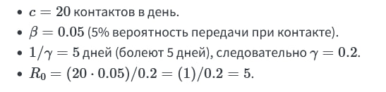

Вывод: один больной в полностью восприимчивой популяции заразит в среднем 5 человек.

## Динамика модели

Количественные результаты сильно зависят от параметров.

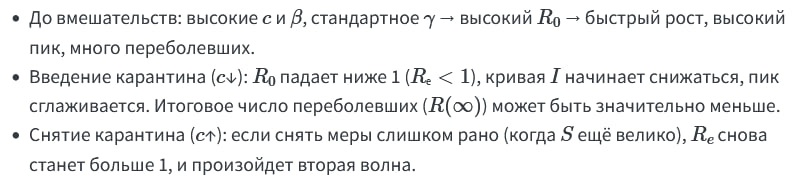

## Ограничения модели

* Однородность популяции (все контактируют одинаково, что неверно: есть супер-распространители).
* Постоянство параметров во времени и для всех людей.
* Отсутствие инкубационного периода.
* Закрытая популяция.

## Практическая ценность трёхпараметрической формы

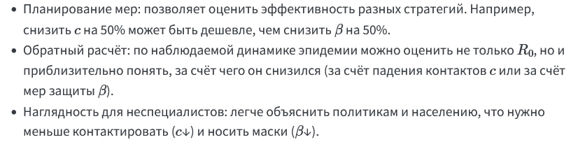{width=70%}

## Инициализация эксперимента

С помощью Julia был реализован эксперимент с моделью SIR.

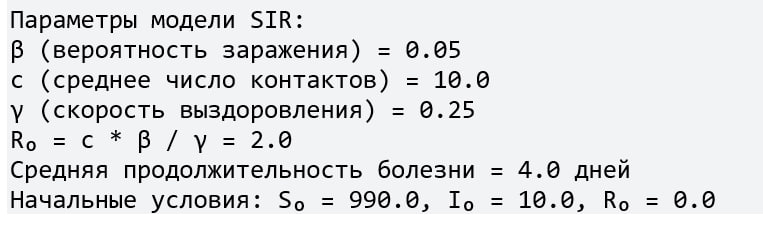{width=70%}

## Результаты

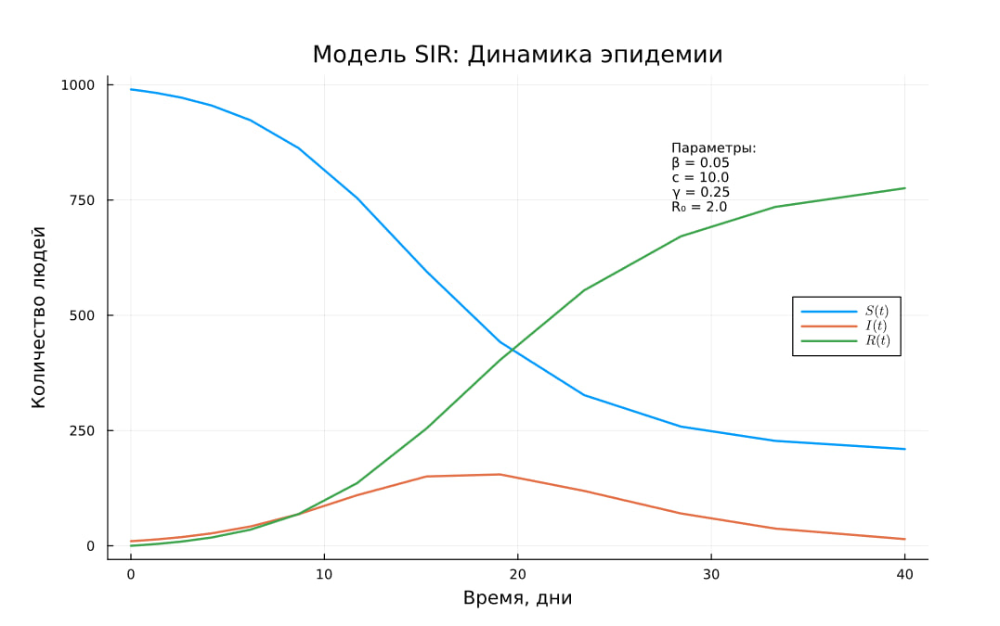{width=70%}

## Результаты

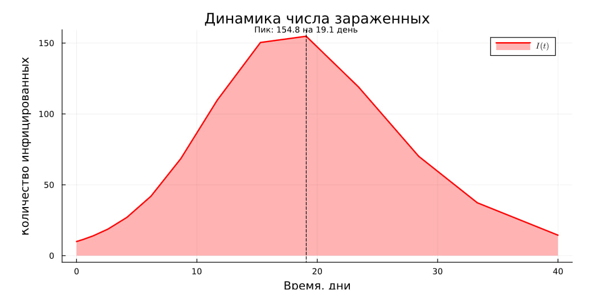{width=70%}

## Результаты

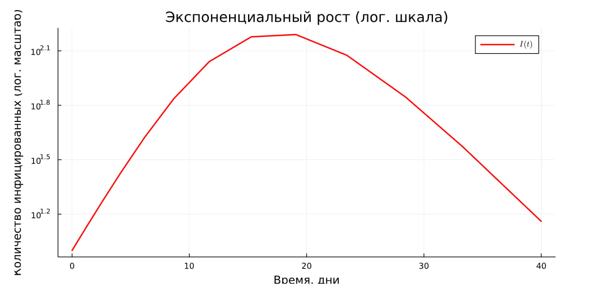{width=70%}

## Результаты

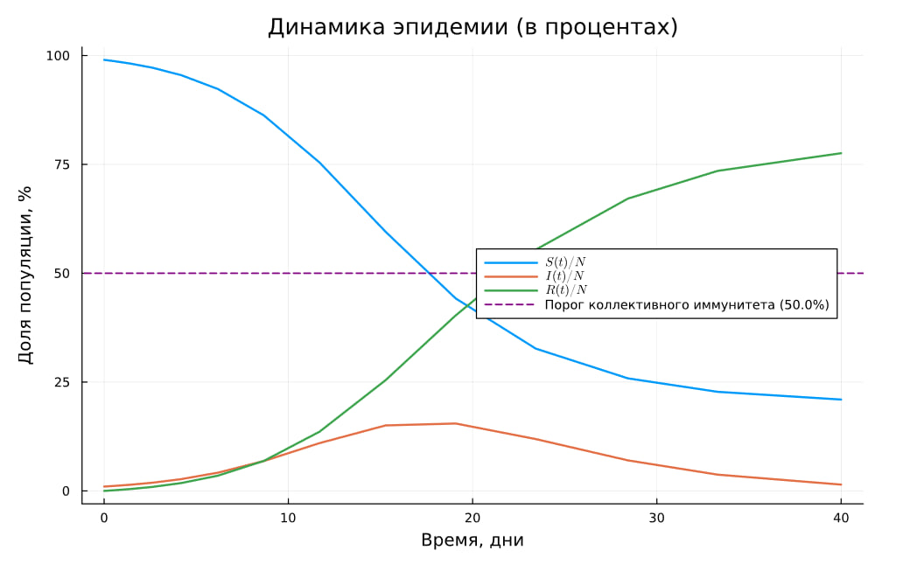{width=70%}

## Результаты

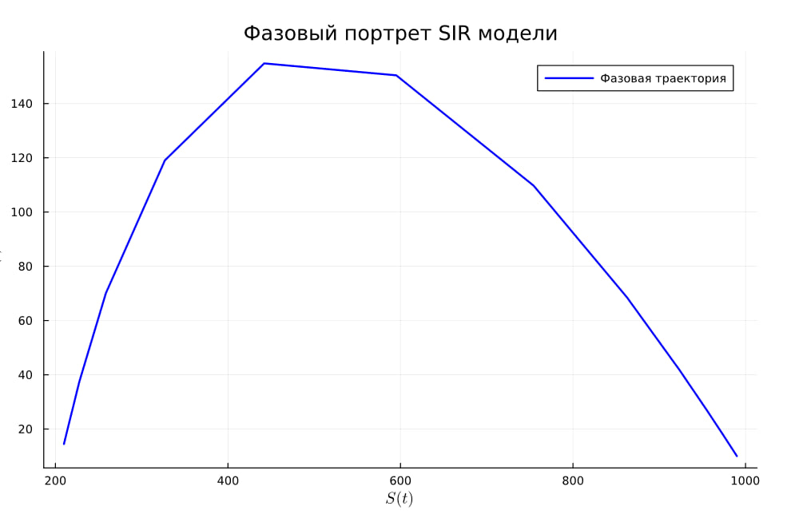{width=70%}

## Результаты

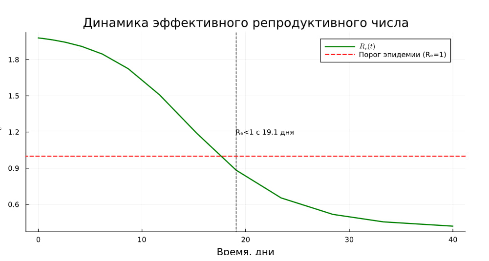{width=70%}

## Результаты

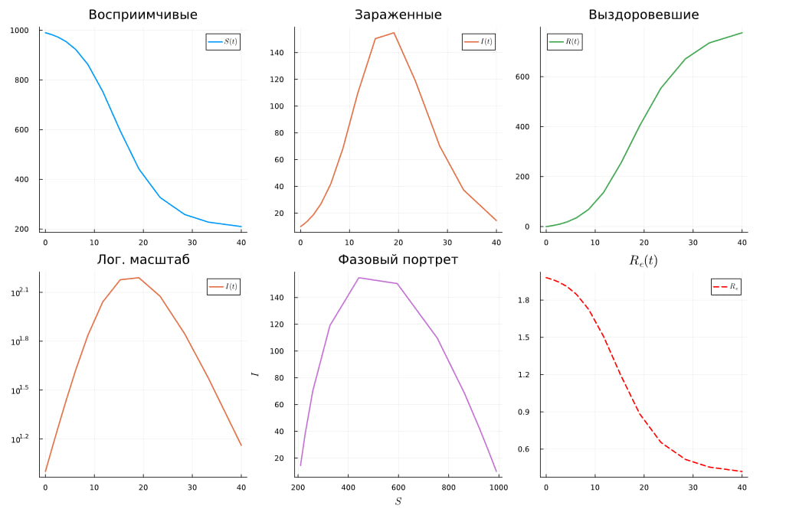{width=70%}

## Результаты

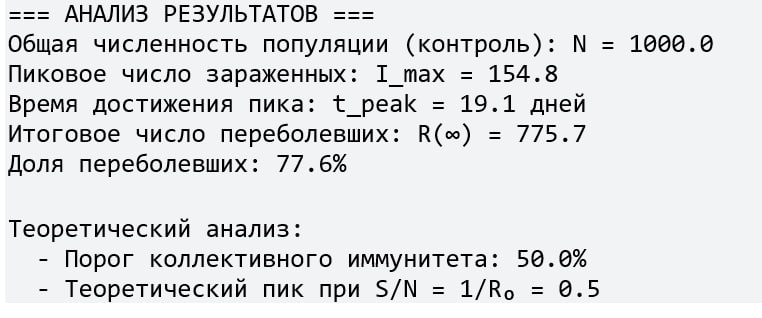{width=70%}

# Работа с моделью Лотки–Вольтерры

Создаю файл lv_ode.jl, запускаю. Код успешно работает.

{#fig-017 width=70%}

## Ключевая идея и исторический контекст

Модель Лотки-Вольтерры — это фундаментальная математическая модель в экологии, описывающая динамику взаимодействия двух видов: хищников и жертв. Она была независимо предложена в 1920-х годах:

* Альфредом Лоткой (1925) для химических реакций .
* Витторио Вольтеррой (1926) для объяснения колебаний улова рыбы в Адриатическом море.

Модель демонстрирует, как даже простая система взаимодействий может порождать сложные колебательные режимы, объясняя циклические изменения численности в природных экосистемах.

## Основные допущения модели

Модель строится на следующих упрощающих предположениях:

* Закрытая система: популяции изолированы, нет миграции.
* Неограниченные ресурсы для жертв: в отсутствие хищников жертвы растут экспоненциально.
* Линейная функциональная реакция: вероятность встречи хищника и жертвы пропорциональна произведению их численностей.
* Постоянные параметры: коэффициенты взаимодействия не меняются во времени.
* Отсутствие внутривидовой конкуренции: нет конкуренции за ресурсы внутри вида.
* Хищники питаются только жертвами: нет альтернативных источников пищи.
* Отсутствие временных задержек: все процессы происходят мгновенно.

## Модель Лотки–Вольтерры

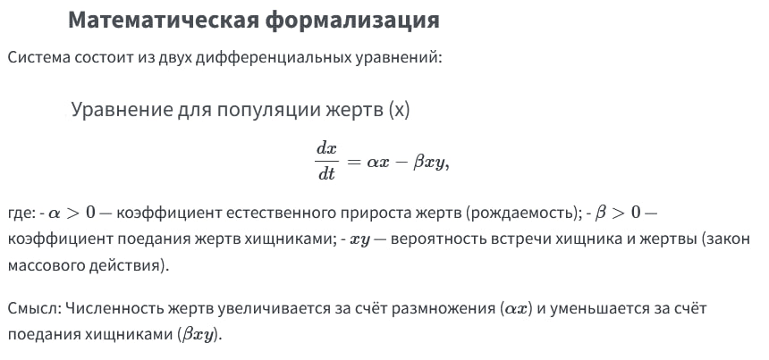{width=70%}

## Модель Лотки–Вольтерры

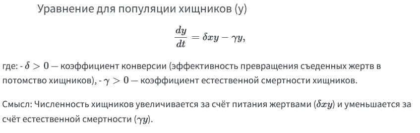{width=70%}

## Модель Лотки–Вольтерры

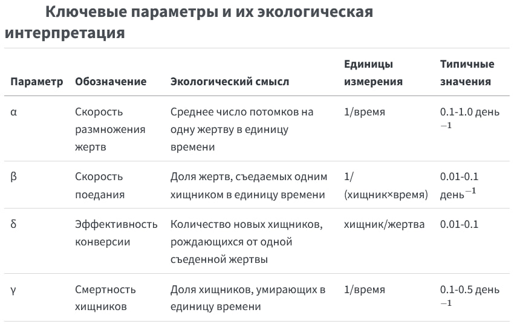{width=70%}

## Ограничения модели

* Слишком идеализирована: игнорирует многие реальные факторы.
* Нейтральная устойчивость: в классическом виде не соответствует реальным системам.
* Отсутствие адаптации: параметры постоянны, нет эволюции.
* Чувствительность к начальным условиям: в стохастических версиях.
* В природе редко наблюдаются чистые циклы без затухания/нарастания.
* Влияние факторов среды (климат, погода) не учитывается.
* Пространственная структура популяций игнорируется.

## Реализация в Julia

Была реализована модель на Julia со следующими параметрами

Параметры модели:
* $\alpha$ (скорость размножения жертв) = 0.1
* $\beta$ (скорость поедания жертв) = 0.02
* $\delta$ (коэффициент конверсии) = 0.01
* $\gamma$ (смертность хищников) = 0.3

Начальные условия:
* Жертвы ($x_{0}$) = 40.0
* Хищники ($y_{0}$) = 9.0

## Результаты

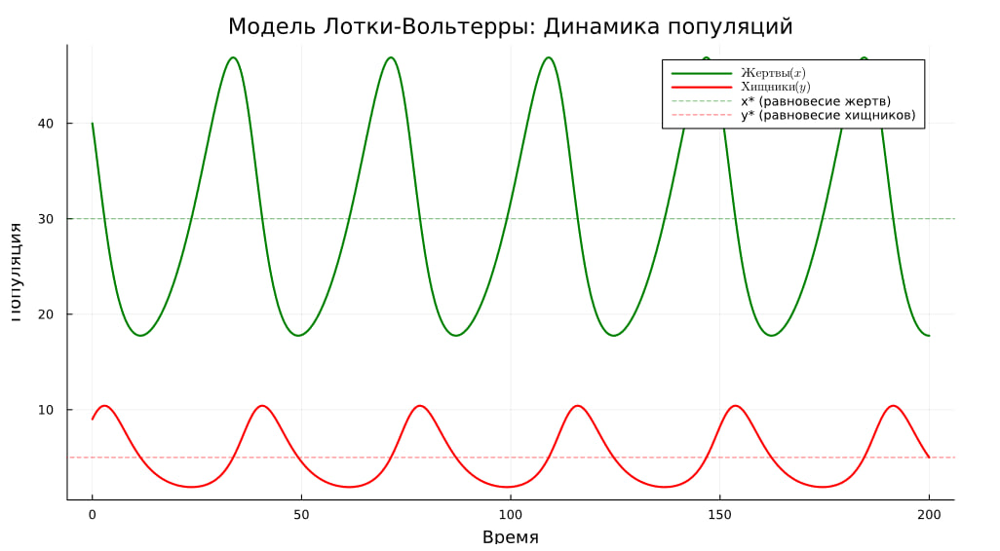{#fig-021 width=70%}

## Результаты

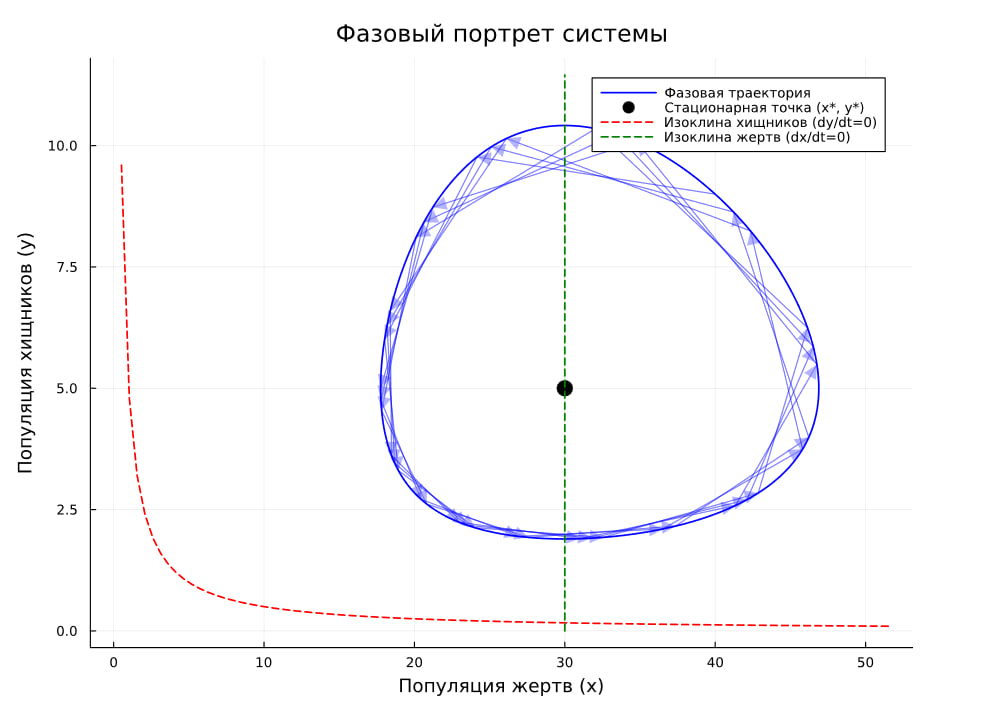{#fig-022 width=70%}

## Результаты

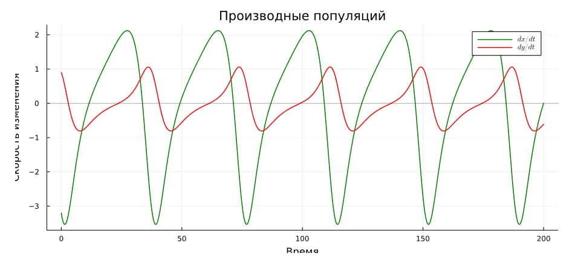{#fig-023 width=70%}

## Результаты

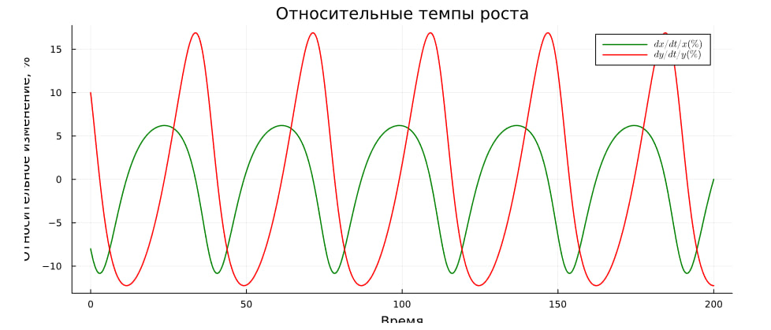{#fig-024 width=70%}

## Результаты

Основные статистики:
* Жертвы: min = 17.75, max = 46.89, mean = 29.71
* Хищники: min = 1.9, max = 10.41, mean = 5.2

## Анализ чувствительности параметров

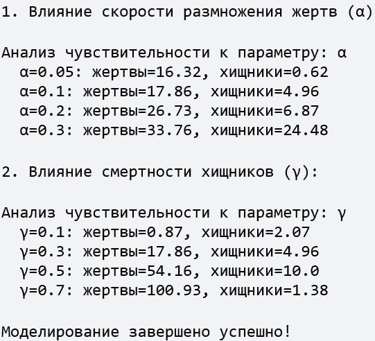{#fig-025 width=70%}

## Создание производных двух файлов моделей

Из обоих файлов программой tangle.jl генерирую чистый код, jupyter notebook, документацию в формате quarto.

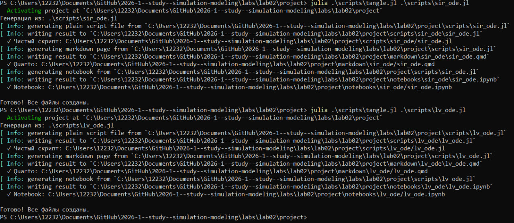{#fig-026 width=70%}

## Создание производных двух файлов моделей

Jupyter notebook sir_ode успешно работает.

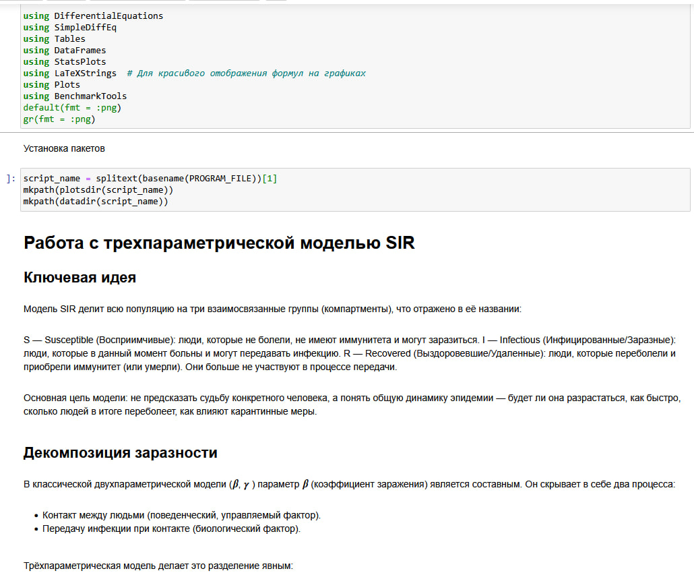{#fig-027 width=70%}

## Создание производных двух файлов моделей

Jupyter notebook lv_ode успешно работает.

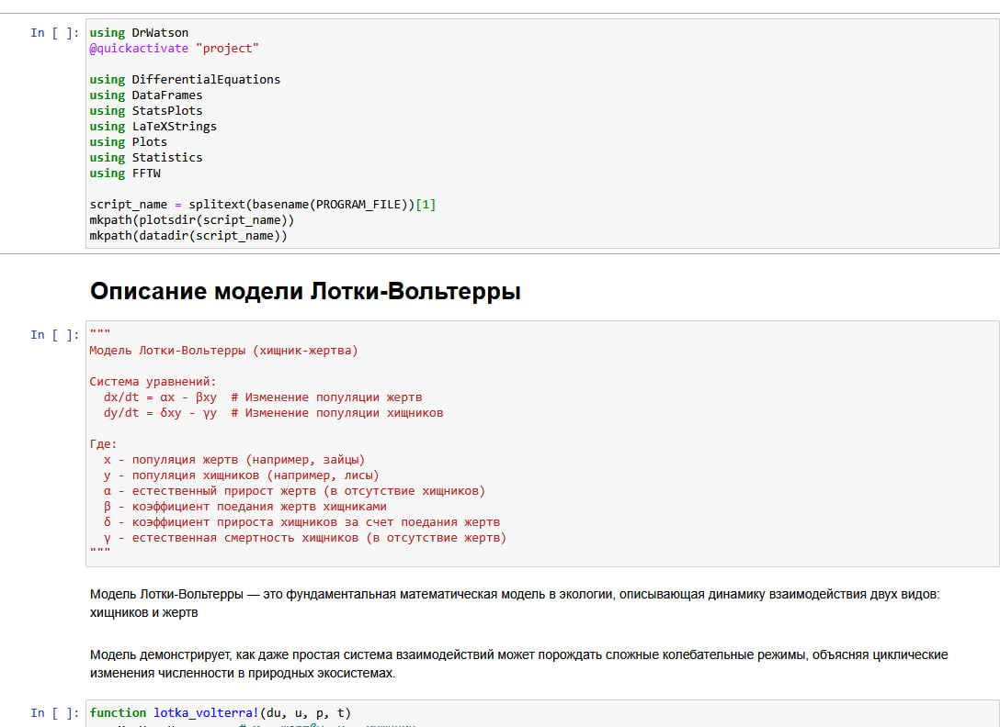{#fig-028 width=70%}

## Выводы

В результате выполнения данной лабораторной работы я ознакомился с моделями SIR и Лотки–Вольтерры, а также с их реализацией в Julia, после чего успешно интегрировал её в данный отчёт.

## Список литературы

[Лабораторная работа №2](https://esystem.rudn.ru/mod/resource/view.php?id=1356134)
