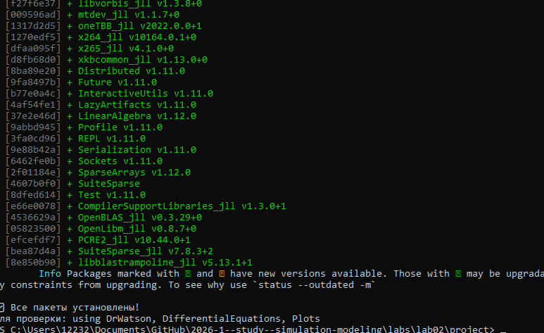
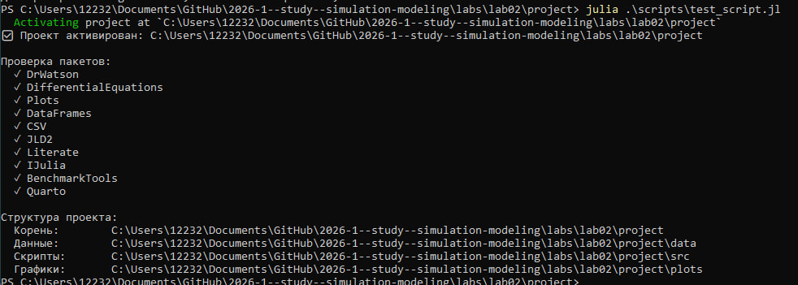
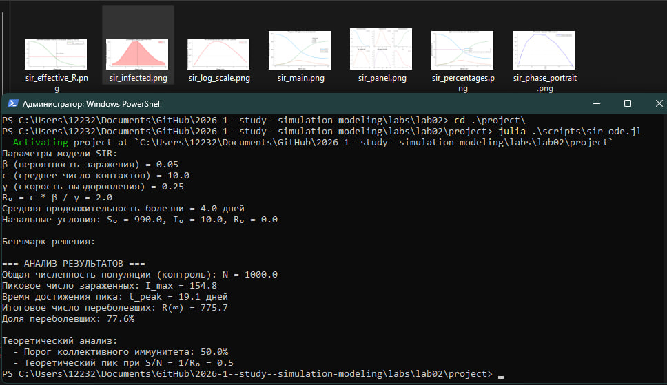
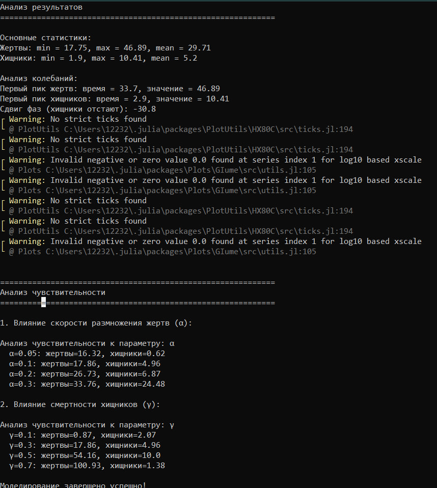

---
## Author
author:
  name: Чистов Даниил Максимович
  degrees: DSc
  orcid: 0000-0002-0877-7063
  email: 1132236021@rudn.ru
  affiliation:
    - name: Российский университет дружбы народов
      country: Российская Федерация
      postal-code: 117198
      city: Москва
      address: ул. Миклухо-Маклая, д. 6

## Title
title: "Лабораторная работа №2"
subtitle: "Имитационное моделирование"
license: "CC BY"
---

# Цель работы

Целью данной работы является изучение математических моделей SIR и Лотки–Вольтерры, а также ознакомление с их реализацией в Julia.

# Задание

* Создать рабочий каталог для кода.
* Установить необходимые пакеты.
* Выполнить предложенный код.
* Преобразовать код в литературный стиль.
* Сгенерировать из литературного кода: чистый код, jupyter notebook, документацию в формате Quarto.
* Выполнить код из jupyter notebook.
* Интегрировать документацию в формате Quarto в отчёт.
* Добавить в код в литературном стиле вычисление для набора параметров.
* Сгенерировать из литературного кода с параметрами: чистый код, jupyter notebook, документацию в формате Quarto.
* Выполнить код из jupyter notebook с параметрами.
* Интегрировать документацию с параметрами в формате Quarto в отчёт.

# Выполнение лабораторной работы

В папке lab02 инициализирую проект для данной лабораторной работы ([рис. @fig-001])

{#fig-001 width=70%}

Устанавливаю необходимые пакеты ([рис. @fig-002]).

{#fig-002 width=70%}

Проверяю, что все пакеты скачены ([рис. @fig-003]).

{#fig-003 width=70%}

## Работа с моделью SIR

Создаю файл sir_ode.jl, запускаю его. Код успешно работает ([рис. @fig-004]).

{#fig-004 width=70%}



## Работа с моделью Лотки–Вольтерры

Создаю файл lv_ode.jl, запускаю. Код успешно работает ([рис. @fig-005]).

{#fig-005 width=70%}



## Создание производных двух файлов моделей

Из обоих файлов программой tangle.jl генерирую чистый код, jupyter notebook, документацию в формате quarto ([рис. @fig-006]).

{#fig-006 width=70%}

Jupyter notebook sir_ode успешно работает ([рис. @fig-007]).

{#fig-007 width=70%}

Jupyter notebook lv_ode успешно работает ([рис. @fig-008]).

{#fig-008 width=70%}

# Выводы

В результате выполнения данной лабораторной работы я ознакомился с моделями SIR и Лотки–Вольтерры, а также с их реализацией в Julia, после чего успешно интегрировал её в данный отчёт.

# Список литературы

[Лабораторная работа №2](https://esystem.rudn.ru/mod/resource/view.php?id=1356134)
