---
## Author
author:
  name: Чистов Даниил Максимович
  degrees: DSc
  orcid: 0000-0002-0877-7063
  email: 1132236021@rudn.ru
  affiliation:
    - name: Российский университет дружбы народов
      country: Российская Федерация
      postal-code: 117198
      city: Москва
      address: ул. Миклухо-Маклая, д. 6

## Title
title: "Лабораторная работа №3"
subtitle: "Имитационное моделирование"
license: "CC BY"
---
```{julia}
import Pkg
Pkg.activate("../project")
Pkg.instantiate()
```

# Цель работы

Целью данной работы является изучение агентного подхода имитационного моделирования на примере модели Daisyworld, реализованной на Julia.

# Задание

* Изучить агентный подход на примере daisyworld
* Создать рабочий каталог для кода.
* Установить необходимые пакеты.
* Выполнить предложенный код.
* Преобразовать код в литературный стиль.
* Сгенерировать из литературного кода: чистый код, jupyter notebook, документацию в формате Quarto.
* Выполнить код из jupyter notebook.
* Интегрировать документацию в формате Quarto в отчёт.

# Об агентном подходе

Агентный подход к имитационному моделированию (Agent-Based Modeling, ABM) — это метод исследования сложных систем, в котором поведение системы возникает из взаимодействия множества автономных сущностей, называемых агентами. Вместо того чтобы описывать систему глобальными уравнениями, мы моделируем каждую индивидуальную единицу и правила её поведения, а затем наблюдаем, какие коллективные паттерны появляются снизу вверх. Этот подход особенно полезен, когда поведение системы трудно предсказать из-за нелинейностей, гетерогенности участников или адаптивных стратегий.

## Агенты

Это активные сущности, которые обладают:
* Свойствами (атрибутами): возраст, цвет, запас ресурсов, координаты и т.п.
* Правилами поведения: как агент реагирует на изменения среды и действия других агентов (например, перемещение, размножение, потребление).
* Целями (не обязательно): в некоторых моделях агенты стремятся максимизировать свою выгоду или выжить.
* Способностью к обучению или адаптации (в продвинутых моделях).

## Среда

Это пространство, в котором существуют агенты. Она может быть:
* Дискретной (клеточная сетка, как в Daisyworld).
* Непрерывной (двумерное или трёхмерное пространство).
* Сетевой (граф социальных связей).
* Абстрактной (например, рынок без явных координат).

## Взаимодействия 

Это — правила, определяющие, как агенты влияют друг на друга и на среду. Они могут быть:
* Локальными (только с соседями).
* Глобальными (все агенты взаимодействуют со всеми).
* Через среду (агенты изменяют среду, а среда влияет на агентов

## Основные принципы агентного моделирования

* Эмерджентность: глобальное поведение системы не закладывается явно, а возникает из локальных взаимодействий. Это позволяет открывать неожиданные закономерности.
* Автономия: агенты действуют независимо, на основе своей внутренней логики.
* Гетерогенность: агенты могут различаться по своим характеристикам и правилам, что отражает реальное разнообразие.
* Локальность: чаще всего агенты обладают информацией только о своём ближайшем окружении.

## Преимущества агентного подхода

Благодаря такому подходу можно моделировать системы любой сложности, агенты которых будут индивидуальными и адаптивными, т. е. у каждого имеется конкретный специфичный набор аттрибутов и все они могут менять своё поведение в зависимости от текущего состояния среды. 

Также динамику модели можно визуализировать на каждом шагу, а также благодаря тонкой настройке параметров среды, агентов и взаимодействий, можно проверять, как микро-правила приводят к макро-явлениям.

# О модели Daisyworld

Существует мир (среда 30 на 30 клеток) из чёрных и белых маргариток, нагреваемый солнцем.

Маргаритки являются агентами модели, они стареют и умирают после определённого возраста (параметр задаётся самостоятельно). Сами маргаритки, в зависимости от их цвета, влияют на общую температуру среды. Температура влияет на вероятность размножения (чем ближе к оптимуму, тем выше шанс заселить соседнюю пустую клетку)

Альбедо маргариток различается: 
- Чёрные маргаритки поглощают свет и тепло, нагревая окружающую среду;
- Белые маргаритки делают наоборот.

Маргаритки могут размножаться только в определённом температурном диапазоне, а это значит, что слишком много (или слишком мало) тепла от солнца и/или окружающей среды в конечном итоге остановит их размножение.

Пока температура благоприятна, маргаритки конкурируют за землю и пытаются дать начало новому растению в местах, расположенных неподалёку от них.

Когда климат слишком холодный, черным маргариткам необходимо размножаться, чтобы повысить температуру, и наоборот — когда климат слишком теплый, необходимо производить больше белых маргариток, чтобы охладить климат.

Существуют следующие параметры:
* luminosity - солнечная постоянная (может изменяться со временем).
* albedo_black, albedo_white - альбедо чёрных и белых маргариток.
* surface_albedo - альбедо пустой почвы.
* max_age - максимальный возраст маргаритки.

## Динамика модели

- Для каждой клетки рассчитывается локальная температура.
- Каждая маргаритка может погибнуть с вероятностью, зависящей от температуры. Если температура выходит за допустимый диапазон, вероятность смерти повышается.
- Если клетка пуста, на неё может попасть семя от соседней маргаритки. Вероятность успешного прорастания зависит от температуры клетки. Если вероятность превышает случайное число, на пустой клетке появляется новая маргаритка того же цвета, что и родительская.

# Выполнение лабораторной работы

В папке lab03 инициализирую проект для данной лабораторной работы ([рис. @fig-001])

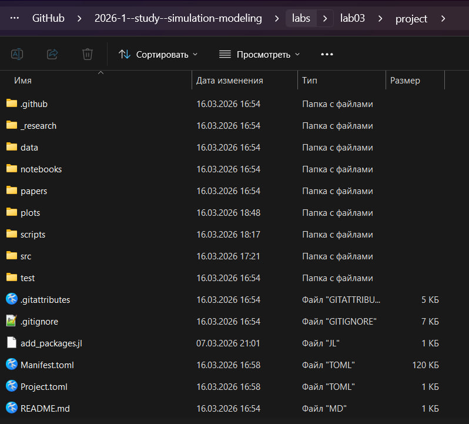{#fig-001 width=70%}

## Работа с daisyworld

### Базовая визуализация

Предварительно создаю файл daisyworld.jl в папке /src. Он будет использоваться последующими программами. Этот код и является моделью daisyworld ([рис. @fig-002]).

{#fig-002 width=70%}

Создаю файл daisyworld.jl в папке /scripts, запускаю его. Код успешно работает ([рис. @fig-003]).

{#fig-003 width=70%}

Создаю файл производные файла daisyworld.jl. Все файлы успешно созданы ([рис. @fig-004]).

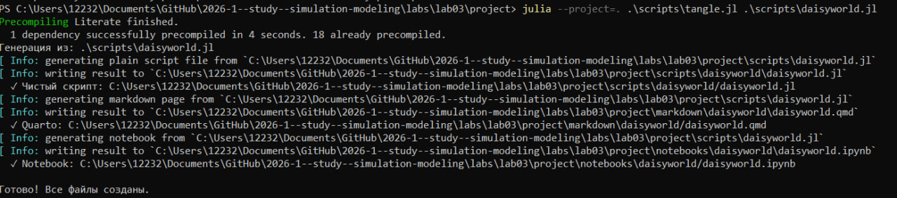{#fig-004 width=70%}

Проверяю jupyter notebook daisyworld.jl. Файл успешно работает. Аналогичные шаги будут произведены с послеующими программами: преобразование в литературный стиль, генерация производных, проверка работы ([рис. @fig-005]).

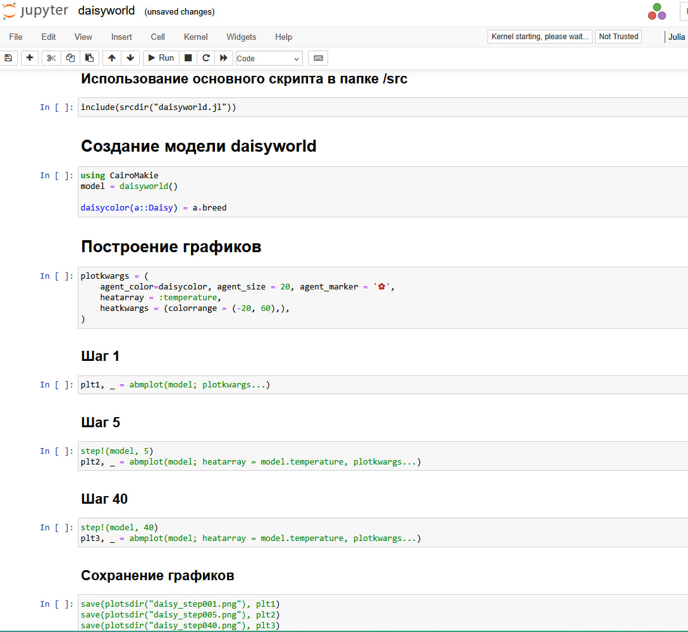{#fig-005 width=70%}



В результате работы программы были получены следующие графики: ([рис. @fig-006]), ([рис. @fig-007]), ([рис. @fig-008]).

{#fig-006 width=70%}

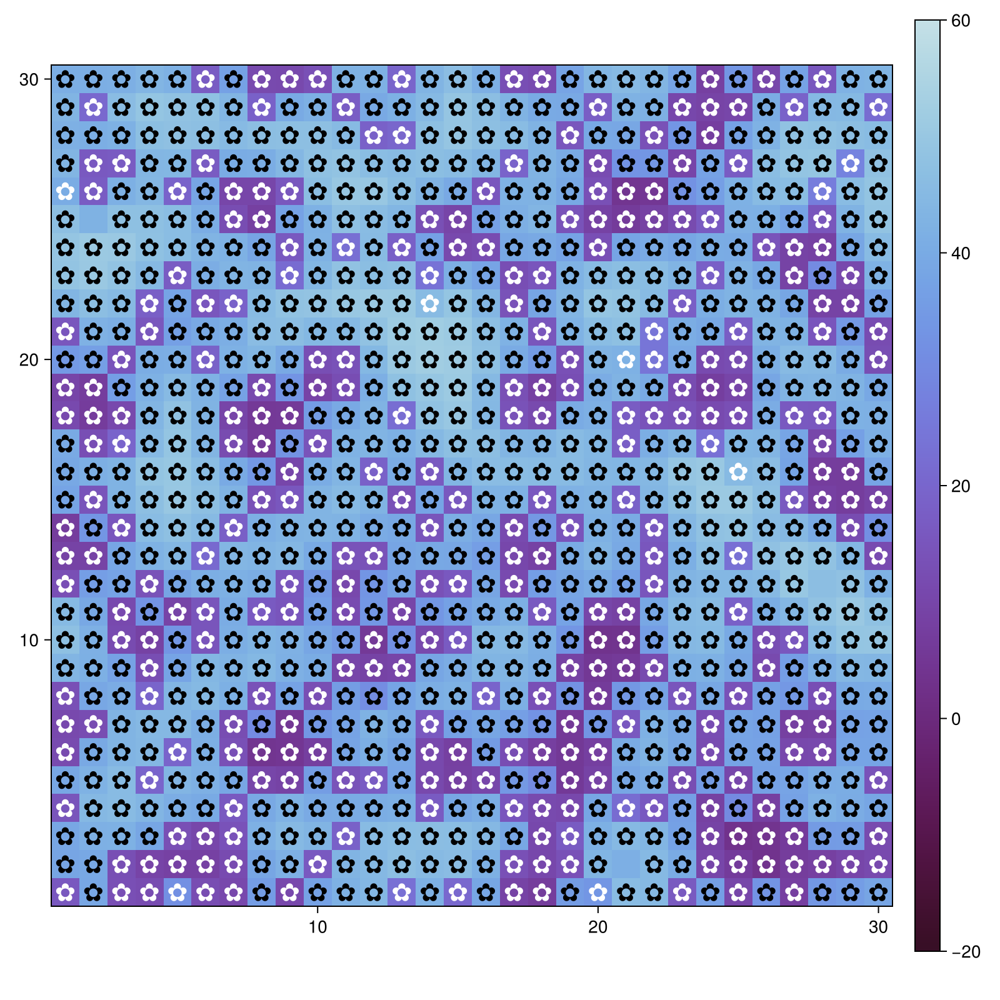{#fig-007 width=70%}

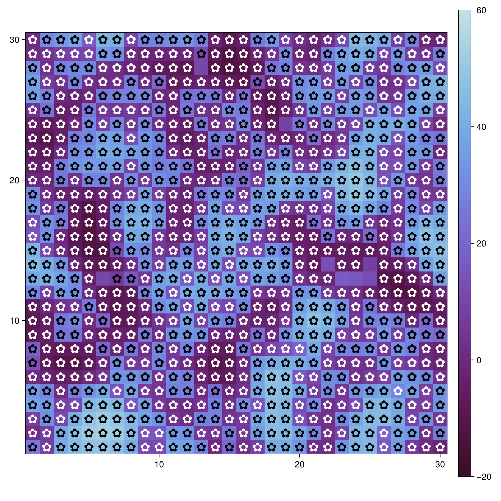{#fig-008 width=70%}

### Анимация модели

Для создания анимации модели был создан скрипт daisyworld-animate.jl. В результате была успешно сгенерирована анимация развития модели на каждом шаге. Видеофайл вы можете открыть, нажав на следующие ссылки, или найдя его в папке lab03/project/plots/simulation.mp4:

* [VkVideo](https://vkvideo.ru/video-236173984_456239026?list=ln-RtILZhT51CxUzHCcWX)
* [RuTube](https://rutube.ru/video/private/22ea9ade1151ce82d541e4c14e3682e2/?p=Td2jVgtIJcvm-Ly7f5uGLQ)

### Динамика числа маргариток

Для визуализации числа маргариток был создан скрипт daisyworld-count.jl. Ниже его реализация в литературном виде:



В результате работы программы был получен следующий график: ([рис. @fig-009])

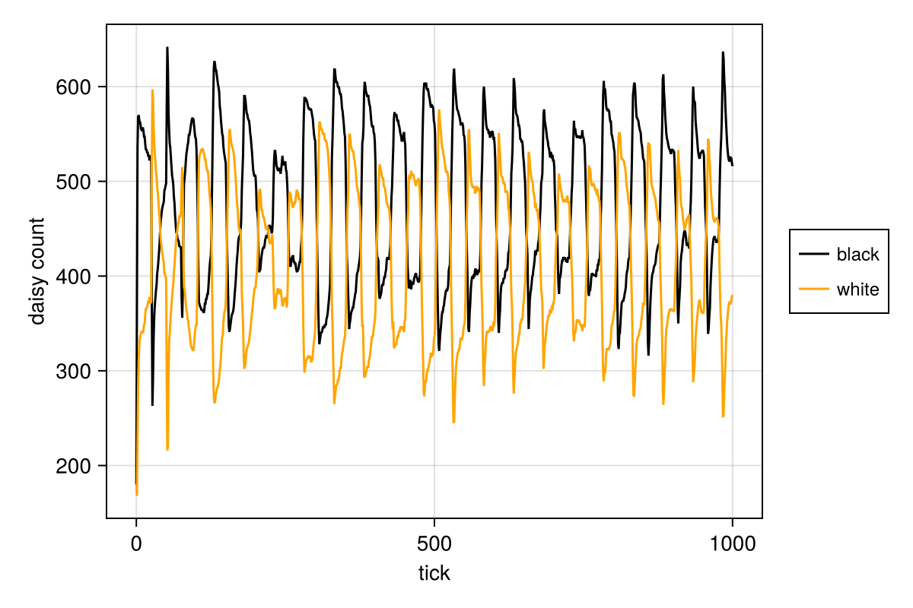{#fig-009 width=70%}

### Динамика модели

Был создан скрипт для генерации комплексного графика изменения числа маргариток, температуры, альбедо в зависимости от модельного времени - daisyworld-luminosity.jl. Ниже представлена его реализация в литературном виде:



В результате работы программы был получен комплексный график, показывающий число маргариток, температуру, альбедо в зависимости от модального времени: ([рис. @fig-010])

{#fig-010 width=70%}

### Параметрическая реализация и визуализация

Для изучения модели полезно провести подбор параметров, после чего ознакомиться с различными результатами экспериментов. Для этого был создан скрипт daisyworld__param.jl. Ниже его реализация в литературном виде:



В результате работы программы было получено 12 графиков модели daisyworld - по три изображения на каждый вариант параметров: 

#### Комбинация №1

Параметры: 
* albedo_black=0.25
* albedo_white=0.75
* init_black=0.2
* init_white=0.2
* max_age=25
* scenario=default
* seed=165
* solar_change=0.005
* solar_luminosity=1.0
* surface_albedo=0.4

Визуализация результатов: ([рис. @fig-011]), ([рис. @fig-012]), ([рис. @fig-013])

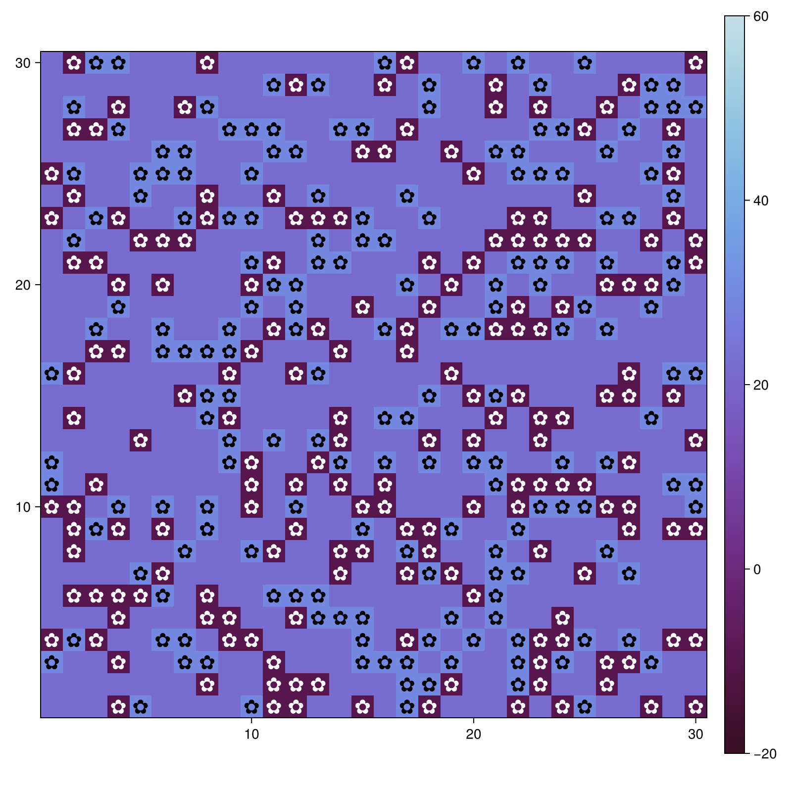{#fig-011 width=70%}

{#fig-012 width=70%}

{#fig-013 width=70%}

#### Комбинация №2

Параметры:
* albedo_black=0.25 
* albedo_white=0.75 
* init_black=0.2
* init_white=0.2
* max_age=40 - Максимальный возраст маргаритки повышен до 40
* scenario=default
* seed=165
* solar_change=0.005
* solar_luminosity=1.0
* surface_albedo=0.4

Визуализация результатов: ([рис. @fig-014]), ([рис. @fig-015]), ([рис. @fig-016])

{#fig-014 width=70%}

{#fig-015 width=70%}

{#fig-016 width=70%}

#### Комбинация №3

Параметры:
* albedo_black=0.25 
* albedo_white=0.75 
* init_black=0.2
* init_white=0.8 - Повышено с 0.2 до 0.8
* max_age=25 - Максимальный возраст маргаритки: 25
* scenario=default
* seed=165
* solar_change=0.005
* solar_luminosity=1.0
* surface_albedo=0.4

Визуализация результатов: ([рис. @fig-017]), ([рис. @fig-018]), ([рис. @fig-019])

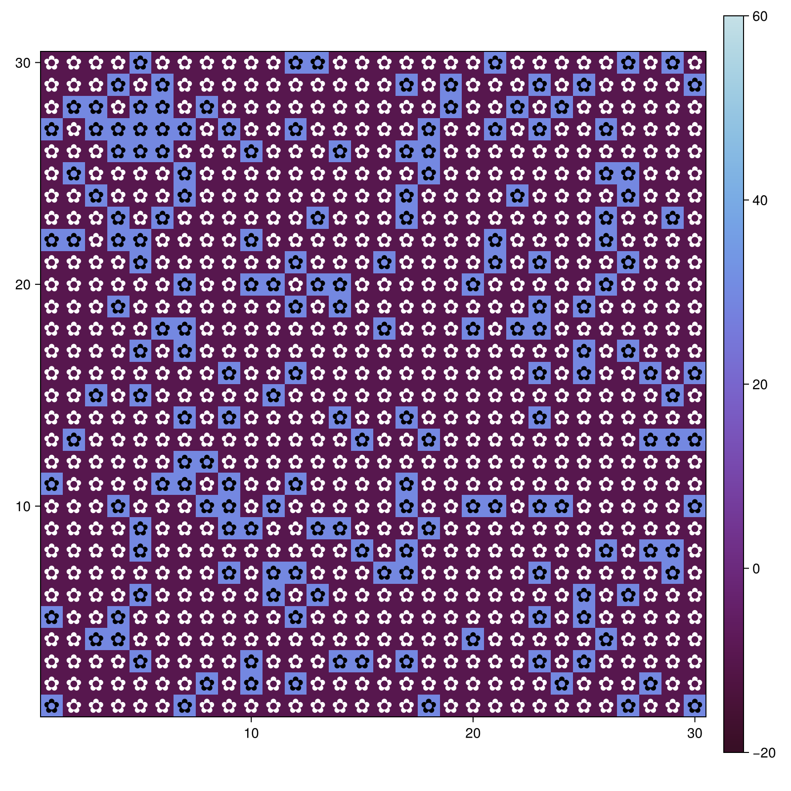{#fig-017 width=70%}

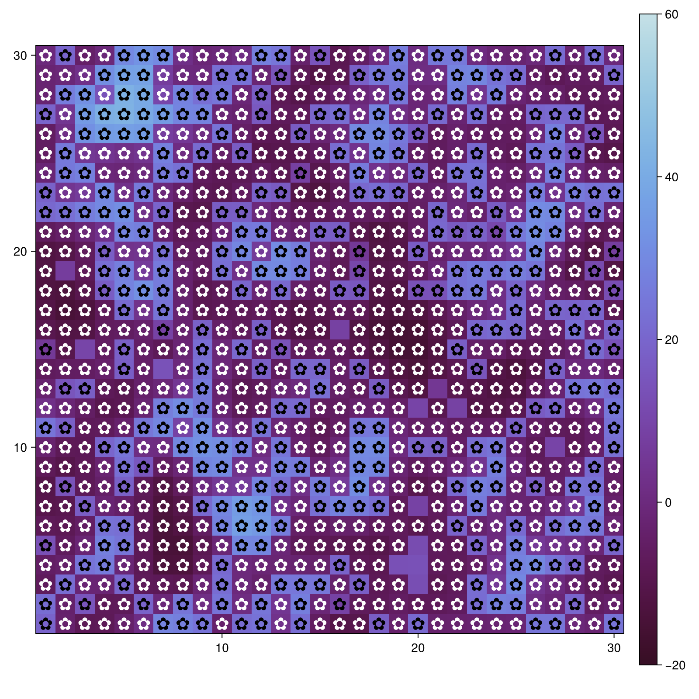{#fig-018 width=70%}

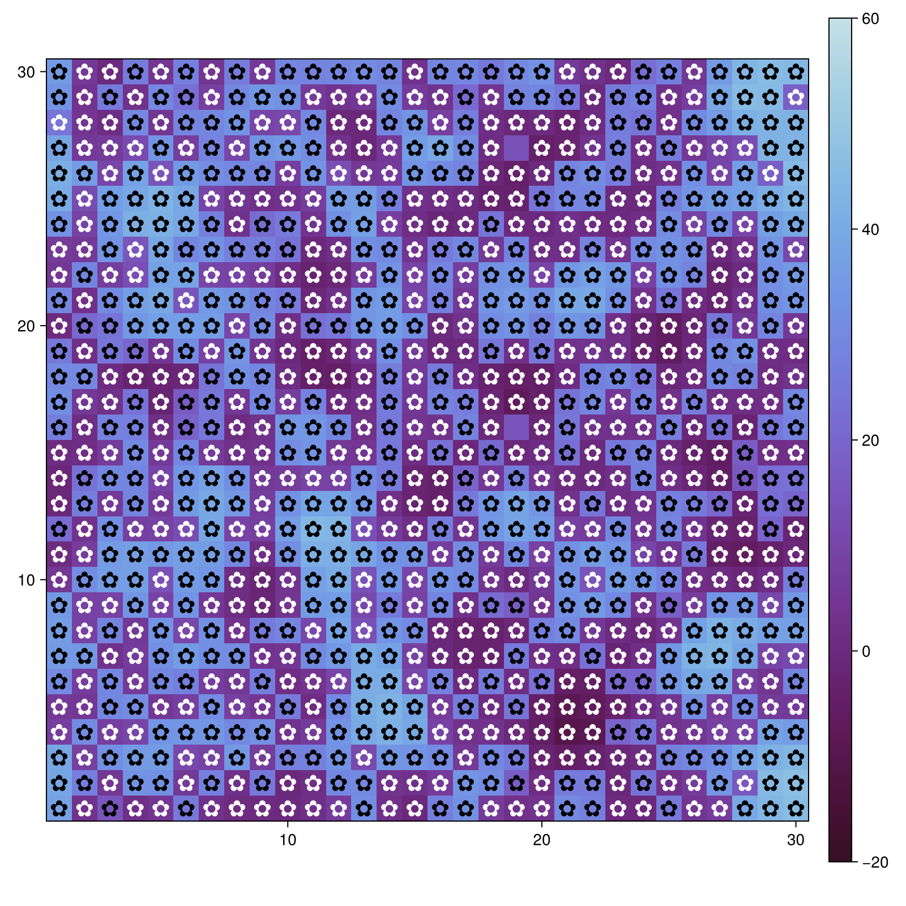{#fig-019 width=70%}

#### Комбинация №4

Параметры:
* albedo_black=0.25 
* albedo_white=0.75 
* init_black=0.2
* init_white=0.8 - Повышено с 0.2 до 0.8
* max_age=40 - Максимальный возраст маргаритки повышен до 40
* scenario=default
* seed=165
* solar_change=0.005
* solar_luminosity=1.0
* surface_albedo=0.4

Визуализация результатов: ([рис. @fig-020]), ([рис. @fig-021]), ([рис. @fig-022])

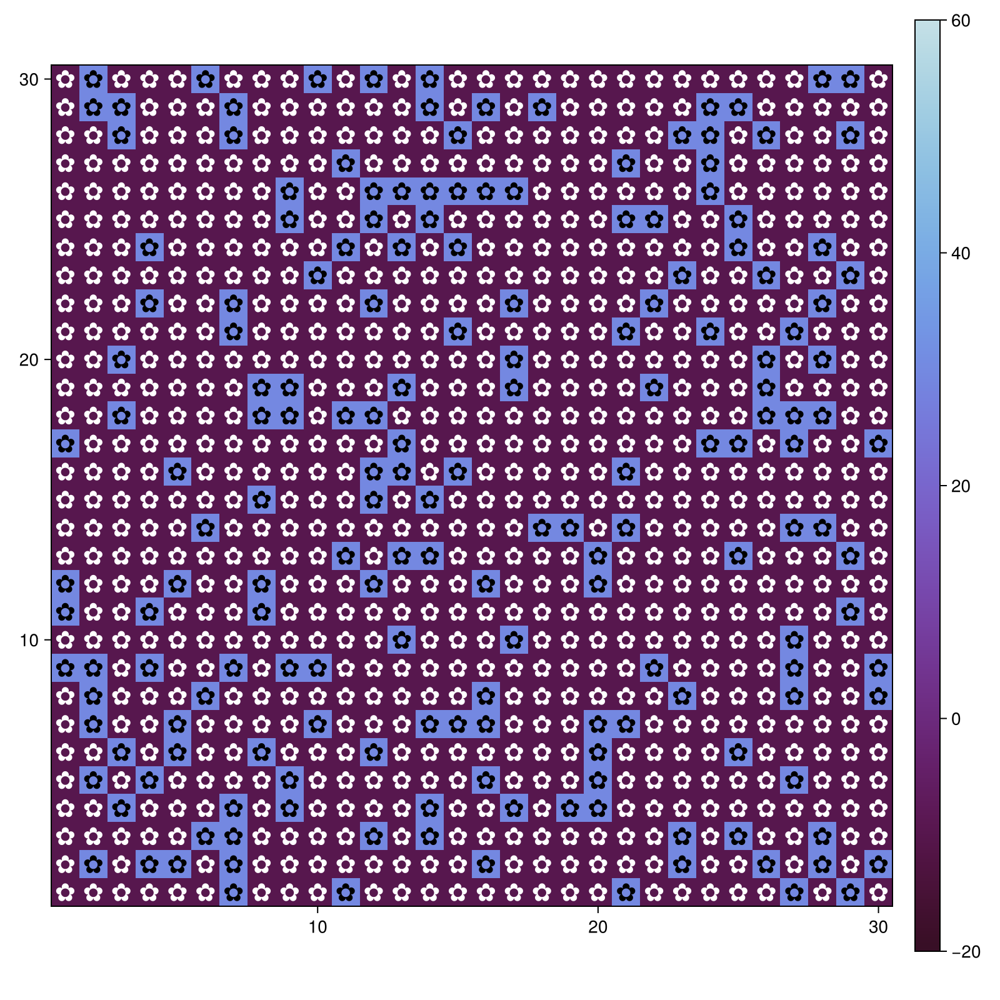{#fig-020 width=70%}

{#fig-021 width=70%}

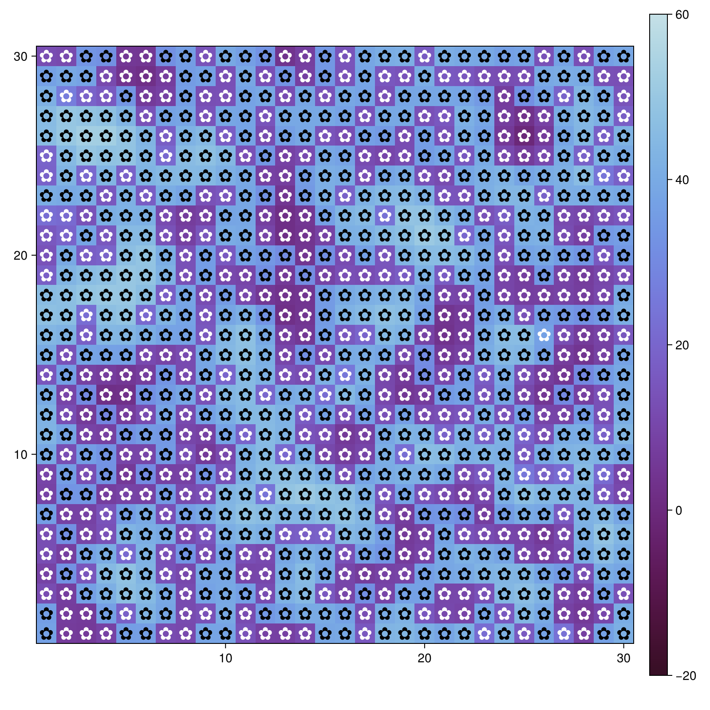{#fig-022 width=70%}

### Параметрическая реализация - Динамика числа маргариток

Для анализа влияния параметров на количество маргариток был создан скрипт daisyworld-count__param.jl. Ниже его реализация в литературном виде:



В результате были получены следующие графики: 

#### Комбинация №1

Набор параметров 1: ([рис. @fig-023])

Параметры: 
* albedo_black=0.25
* albedo_white=0.75
* init_black=0.2
* init_white=0.2
* max_age=25
* scenario=default
* seed=165
* solar_change=0.005
* solar_luminosity=1.0
* surface_albedo=0.4

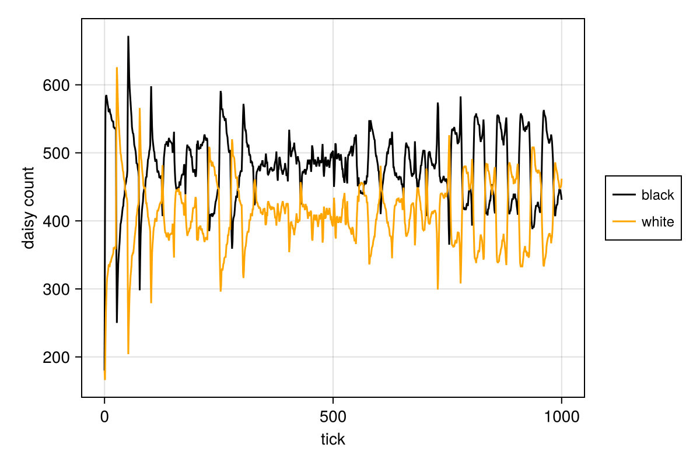{#fig-023 width=70%}

#### Комбинация №2

Набор параметров 2: ([рис. @fig-024])

Параметры:
* albedo_black=0.25 
* albedo_white=0.75 
* init_black=0.2
* init_white=0.2
* max_age=40 - Максимальный возраст маргаритки повышен до 40
* scenario=default
* seed=165
* solar_change=0.005
* solar_luminosity=1.0
* surface_albedo=0.4

{#fig-024 width=70%}

#### Комбинация №3

Набор параметров 3: ([рис. @fig-025])

Параметры:
* albedo_black=0.25 
* albedo_white=0.75 
* init_black=0.2
* init_white=0.8 - Повышено с 0.2 до 0.8
* max_age=25 - Максимальный возраст маргаритки: 25
* scenario=default
* seed=165
* solar_change=0.005
* solar_luminosity=1.0
* surface_albedo=0.4

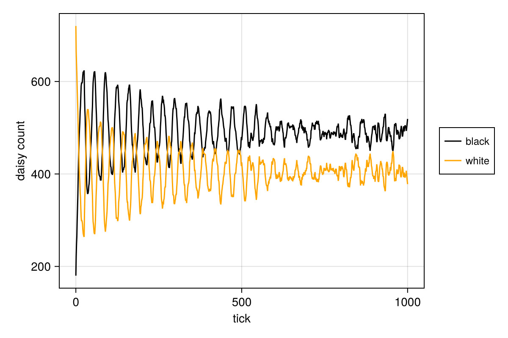{#fig-025 width=70%}

#### Комбинация №4

Набор параметров 4: ([рис. @fig-026])

Параметры:
* albedo_black=0.25 
* albedo_white=0.75 
* init_black=0.2
* init_white=0.8 - Повышено с 0.2 до 0.8
* max_age=40 - Максимальный возраст маргаритки повышен до 40
* scenario=default
* seed=165
* solar_change=0.005
* solar_luminosity=1.0
* surface_albedo=0.4

{#fig-026 width=70%}

### Параметрическая реализация - Динамика температуры, альбедо, числа маргариток

Для анализа влияния параметров на температуру, альбедо, число маргариток был создан скрипт daisyworld-luminosity__param.jl. Ниже его реализация в литературном виде:



В результате были получены следующие графики: 

#### Комбинация №1

Набор параметров 1: ([рис. @fig-027])

Параметры: 
* albedo_black=0.25
* albedo_white=0.75
* init_black=0.2
* init_white=0.2
* max_age=25
* scenario=default
* seed=165
* solar_change=0.005
* solar_luminosity=1.0
* surface_albedo=0.4

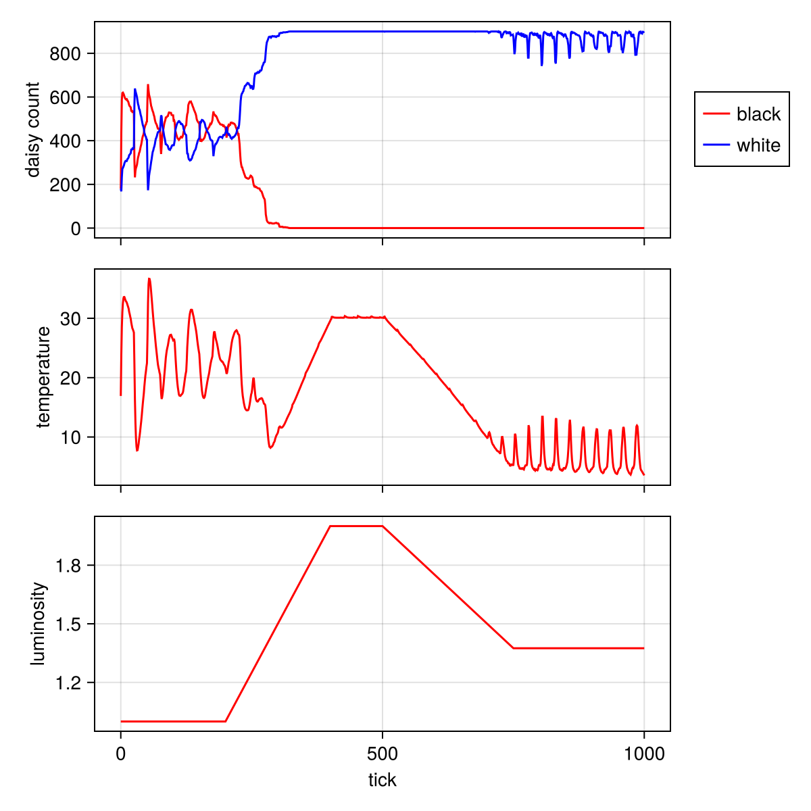{#fig-027 width=70%}

#### Комбинация №2

Набор параметров 2: ([рис. @fig-028])

Параметры:
* albedo_black=0.25 
* albedo_white=0.75 
* init_black=0.2
* init_white=0.2
* max_age=40 - Максимальный возраст маргаритки повышен до 40
* scenario=default
* seed=165
* solar_change=0.005
* solar_luminosity=1.0
* surface_albedo=0.4

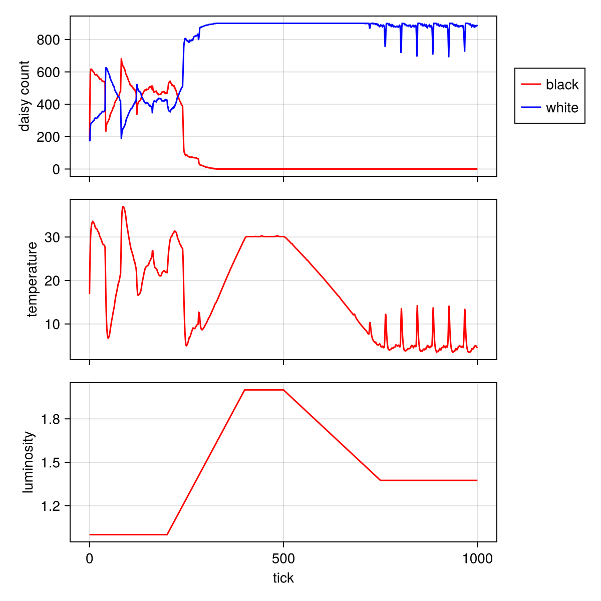{#fig-028 width=70%}

#### Комбинация №3

Набор параметров 3: ([рис. @fig-029])

Параметры:
* albedo_black=0.25 
* albedo_white=0.75 
* init_black=0.2
* init_white=0.8 - Повышено с 0.2 до 0.8
* max_age=25 - Максимальный возраст маргаритки: 25
* scenario=default
* seed=165
* solar_change=0.005
* solar_luminosity=1.0
* surface_albedo=0.4

{#fig-029 width=70%}

#### Комбинация №4

Набор параметров 4: ([рис. @fig-030])

Параметры:
* albedo_black=0.25 
* albedo_white=0.75 
* init_black=0.2
* init_white=0.8 - Повышено с 0.2 до 0.8
* max_age=40 - Максимальный возраст маргаритки повышен до 40
* scenario=default
* seed=165
* solar_change=0.005
* solar_luminosity=1.0
* surface_albedo=0.4

{#fig-030 width=70%}

В результате анализа влияния параметров можно сделать следующие выводы:

* Повышение возраста маргаритки заставило температуру меньше варьироваться на ранних шагах модели
* Повышение исключительно параметра init_white привело к более предсказуемой вариации температуры среды на ранних шагах модели - неоднократно были достигнуты практически одинаковые пики температуры
* Повышение возраста маргаритки вместе с параметром init_white также заставило температуру варьироваться гораздо меньше

Однако, общая картинка по всем параметрам была схожа. Основные изменения происходили на ранних шагах модели.

# Выводы

В результате выполнения данной лабораторной работы я изучил агентный подход имитационного моделирования на примере модели Daisyworld, реализованной на Julia. Разобрался в самой модели и интегрировал её реализацию в данный отчёт.

# Список литературы

[Лабораторная работа №3](https://esystem.rudn.ru/mod/resource/view.php?id=1356134)

# Ссылки на анимацию модели Daisyworld

[VkVideo](https://vkvideo.ru/video-236173984_456239026?list=ln-RtILZhT51CxUzHCcWX)

[RuTube](https://rutube.ru/video/private/22ea9ade1151ce82d541e4c14e3682e2/?p=Td2jVgtIJcvm-Ly7f5uGLQ)
