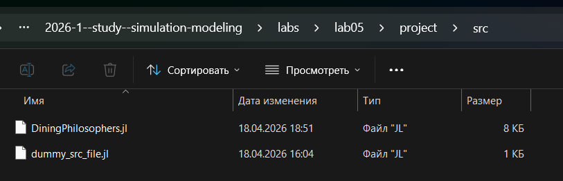
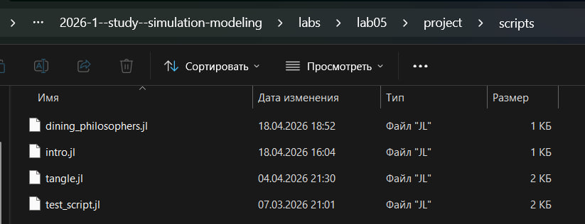
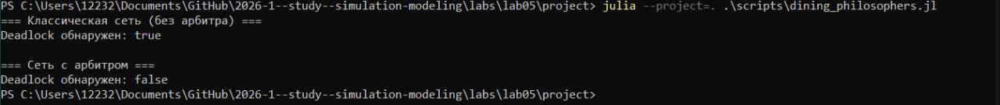
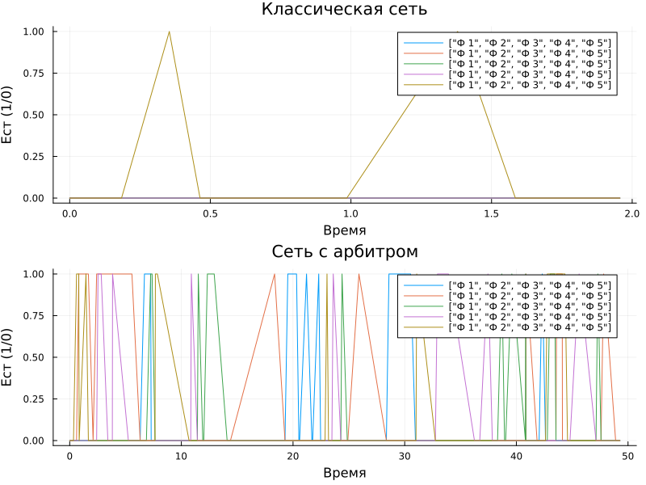

---
## Author
author:
  name: Чистов Даниил Максимович
  degrees: DSc
  orcid: 0000-0002-0877-7063
  email: 1132236021@rudn.ru
  affiliation:
    - name: Российский университет дружбы народов
      country: Российская Федерация
      postal-code: 117198
      city: Москва
      address: ул. Миклухо-Маклая, д. 6

## Title
title: "Лабораторная работа №5"
subtitle: "Имитационное моделирование"
license: "CC BY"
---

```{julia}
import Pkg
Pkg.activate("../project")
Pkg.instantiate()
```

# Цель работы

Целью данной работы ознакомление с сетями Петри на примере задачи "Обедающие философы".

# Задание

1. Ознакомиться с сетями Петри
2. Ознакомиться с задачей "Обедающие философы"
3. Реализовать решение проблемы deadlock, возникающей при базовой реализации решения задачи

# О сетях Петри

## Общая информация

Сеть Петри есть математический аппарат для моделирования дискретных систем. Графически она представляется как двудольный ориентированный граф двух типов вершин: позиции (круги) и переходы (прямоугольники).

* Позиции (Places) суть пассивные элементы, описывающие состояние системы (например, наличие ресурса или выполнение условия).
* Внутри позиции могут находиться фишки (tokens) — неотрицательное целое число, указывающее на количество ресурсов.
* Переходы (Transitions) суть активные элементы, описывающие события или действия системы.
* Они могут срабатывать, изменяя состояние модели.
* Дуги (Arcs) суть направленные соединения между позициями и переходами (но не между двумя позициями или двумя переходами), которые показывают, как состояние влияет на события и наоборот.
* Маркировка (Marking) есть распределение фишек по позициям в определённый момент времени, то есть текущее состояние модели.
* Смена маркировок происходит при срабатывании переходов в соответствии с определёнными правилами.

## Правило срабатывания перехода

Переход считается разрешённым (enabled), если каждая из его входных позиций содержит как минимум столько фишек, сколько указывает кратность входной дуги. Разрешённый переход может сработать (fire). Этот процесс:

* Удаляет из каждой входной позиции количество фишек, равное кратности входной дуги.
* Добавляет в каждую выходную позицию количество фишек, равное кратности выходной дуги.

Срабатывание перехода есть атомарная операция, которая происходит мгновенно и меняет маркировку сети. Если разрешено несколько переходов, любой из них может сработать.

# Задача "Обедающие философы"

Данная задача наглядно демонстрирует явления взаимной блокировки (deadlock) и голодания (starvation) при конкурентном доступе к разделяемым ресурсам. Это одна из самых известных задач, демонстрирующая проблемы параллелизма, в частности, взаимные блокировки (deadlocks) и состояние гонки (race conditions).

## Классическая постановка

За круглым столом сидят N философов (обычно 5). Перед каждым философом стоит тарелка с едой. Между каждыми двумя соседними философами лежит одна вилка (или палочка для еды). Таким образом, количество вилок равно количеству философов

Правила поведения философов:

- Философ может находиться в одном из трёх состояний: думает, голоден (хочет есть), ест.
- Чтобы поесть, философу необходимы две вилки — та, что слева от него, и та, что справа.
- Если философ не может получить обе вилки одновременно, он ждёт, пока они освободятся.
- Поев, философ кладёт обе вилки обратно на стол и возвращается к размышлениям.

Ограничения:

- Вилками нельзя пользоваться одновременно двум философам.
- Философ не может отнять вилку у соседа — только дождаться, пока тот её положит.

## Проблема взаимной блокировки (deadlock)

При наивной реализации (каждый философ сначала берёт левую вилку, затем правую) возникает тупиковая ситуация: если все философы одновременно возьмут левую вилку, то каждый будет ждать правую, которая уже занята соседом. В результате никто не может поесть — система замирает. Это и есть взаимная блокировка.

Для предотвращения deadlock предложены различные подходы:

- Арбитр (официант) — вводится дополнительный процесс, который разрешает есть не более чем N-1 философам одновременно.
- Асимметричное правило — философы с нечётным номером сначала берут левую вилку, затем правую, а чётные — наоборот.
- Атомарный захват — философ берёт обе вилки одновременно (если они свободны) иначе не берёт ни одной.
- Использование мьютексов и условных переменных в программных реализациях.

Задача «Обедающие философы» является классическим примером для моделирования с помощью сетей Петри. Каждый философ и каждая вилка представляются позициями, а переходы соответствуют действиям: «взять левую вилку», «взять правую вилку», «начать есть», «положить вилки». Сеть Петри наглядно показывает возникновение deadlock и позволяет экспериментировать с различными механизмами синхронизации, например, введением арбитра.

# Выполнение лабораторной работы

Перед выполнением работы, поставим следующие цели:

* Построить сеть Петри для пяти философов, моделируя захват и освобождение вилок.
* Обнаружить состояние взаимной блокировки (deadlock), когда каждый философ взял одну вилку и ждёт вторую.
* Провести имитационное моделирование (стохастическое и детерминированное) и выявить наличие deadlock.
* Модифицировать сеть, чтобы предотвратить deadlock.
* Проанализировать результаты и оформить отчёт с графиками и анимацией.

В папке lab05 инициализирую проект для данной лабораторной работы ([рис. @fig-001])

{#fig-001 width=70%}

В папке /src создаю файл DiningPhilosophers.jl. Это код модели задачи обедающих философов, который будет использоваться другими скриптами ([рис. @fig-002])

{#fig-002 width=70%}

Ниже представлен код данной модели:



В папке /scripts создаю файл dining_philosophers.jl ([рис. @fig-003]).

{#fig-003 width=70%}

Скрипт выполняет основное моделирование и сравнение двух вариантов сети Петри:

* классическая модель (без арбитра), в которой возможна взаимная блокировка (deadlock);
* модифицированная модель с арбитром, которая должна предотвращать deadlock.

Классическая сеть должна приводить к deadlock (через некоторое время все философы оказываются в состоянии Hungry, ни один не может есть). Если detect_deadlock возвращает true, это подтверждает теоретический вывод: классическая постановка задачи обедающих философов ведёт к взаимной блокировке.

Сеть с арбитром (дополнительная позиция с N-1 фишками) должна избегать deadlock: detect_deadlock возвращает false. Это демонстрирует один из способов синхронизации для предотвращения тупиков.

Ниже приведён код dining_philosophers.jl:



Данный код: 
* Создаёт классическую сеть Петри для N=5 философов с помощью build_classical_network.
* Запускает стохастическую симуляцию (алгоритм Гиллеспи) на время tmax = 50.0.
* Сохраняет полную историю маркировок в CSV-файл (dining_classic.csv).
* Анализирует последнее состояние на предмет deadlock с помощью detect_deadlock и выводит результат в консоль.
* Строит графики эволюции маркировки по всем позициям (Think, Hungry, Eat, Fork) и сохраняет их как classic_simulation.png.
* Повторяет шаги 1–5 для сети с арбитром (build_arbiter_network), сохраняя результаты в dining_arbiter.csv и arbiter_simulation.png

Код успешно работает ([рис. @fig-004]).

{#fig-004 width=70%}

В результате работы скрипта были получены следующие графики:

* Резлуьтат работы классической модели ([рис. @fig-005]).
* Резлуьтат работы модели с арбитром ([рис. @fig-006]).

{#fig-005 width=70%}

{#fig-006 width=70%}

Графики эволюции маркировки позволяют визуально увидеть, как меняются состояния.

* В классической сети рано или поздно все Eat_i становятся нулевыми, а Hungry_i – единичными (или наоборот).
* В сети с арбитром наблюдается постоянное чередование приёма пищи

## Создание анимации динамики работы сети Петри

Для наглядной демонстрации динамики работы сети Петри во времени создадим скрипт dining_philosophers_animation.jl. 



Данный скрипт: 
* Берёт классическую сеть (для малого числа философов (N=3) для упрощения визуализации).
* Запускает стохастическую симуляцию на tmax = 30.0.
* Создаёт анимацию с помощью макроса @animate, где каждый кадр – это столбчатая диаграмма текущей маркировки (количество фишек в каждой позиции).
* Сохраняет анимацию как GIF-файл philosophers_simulation.gif с частотой 5 кадров в секунду.

С результатом работы скрипта вы можете ознакомиться в папке lab05/report/images или lab05/project/plots - там находится файл анимации philosophers_simulation.gif.

## Создание итогового отчёта 

Для сравнительного анализа двух моделей требуется создать скрипт dining_philosophers_report.jl, который будет загружать ранее сохранённые CSV-файлы (dining_classic.csv и dining_arbiter.csv) из папки data/, извлекать столбцы, соответствующие состоянию Eat_i для каждого философа, строить два временных графика (один под другим): динамику «едящих» философов для классической сети и для сети с арбитром, затем сохранять объединённый график как final_report.png в папку plots/.



В результате был получен следующий график ([рис. @fig-007]).

{#fig-007 width=70%}

Изучив график, можно сделать следующие выводы: 

* На графике классической сети видно, что через некоторое время все линии Eat_i падают до нуля и остаются на нуле - это и есть deadlock, философы больше не могут есть.
* На графике сети с арбитром линии Eat_i колеблются, всегда есть хотя бы один философ, который ест (или они поочерёдно получают доступ).
* Отсутствие длительных нулевых периодов подтверждает, что система жива и не блокируется. 

По данному графику можно сделать вывод, что введение арбитра является эффективным решением пробелмы deadlock

# Выводы

В результате выполнения данной лабораторной работы я изучил сети Петри и поработал с задачей "Обедающие философы", решив проблему deadlock путём введения арбитра.
