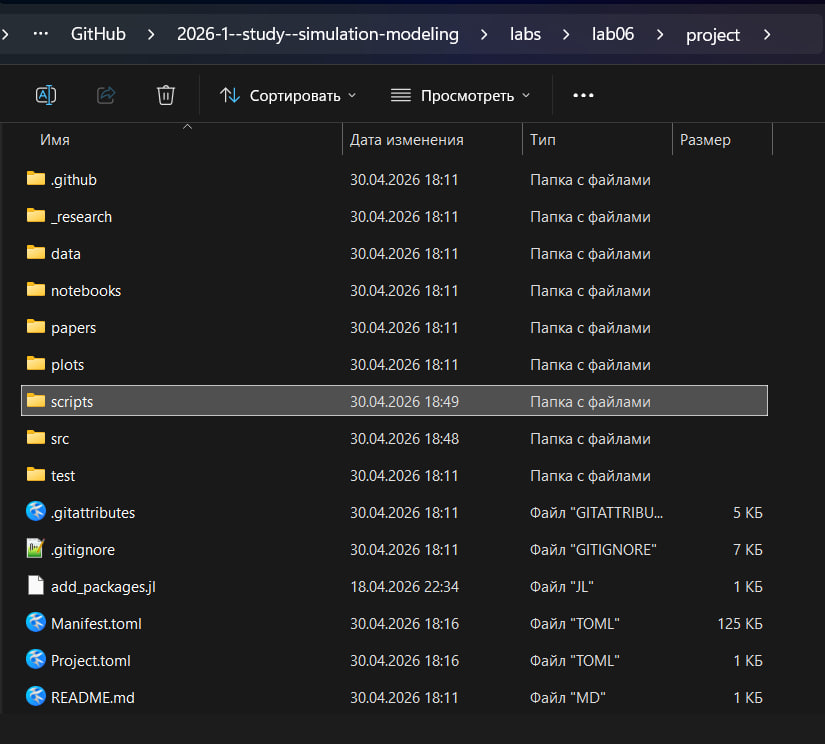
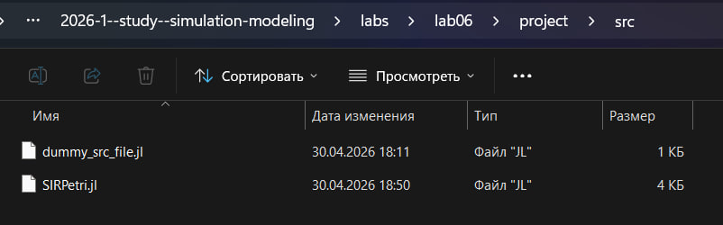
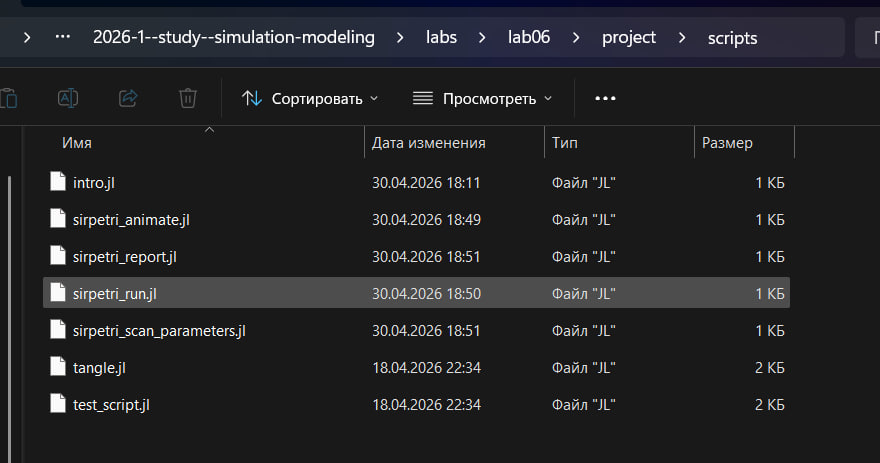
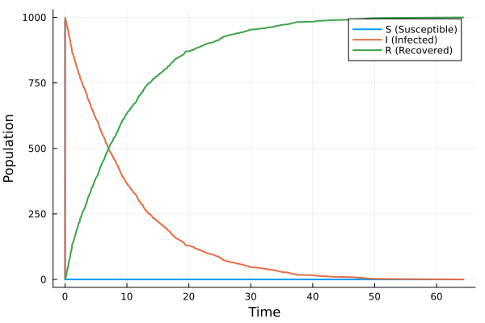

---
## Author
author:
  name: Чистов Даниил Максимович
  degrees: DSc
  orcid: 0000-0002-0877-7063
  email: 1132236021@rudn.ru
  affiliation:
    - name: Российский университет дружбы народов
      country: Российская Федерация
      postal-code: 117198
      city: Москва
      address: ул. Миклухо-Маклая, д. 6

## Title
title: "Лабораторная работа №6"
subtitle: "Имитационное моделирование"
license: "CC BY"
---

```{julia}
import Pkg
Pkg.activate("../project")
Pkg.instantiate()
```

# Цель работы

Целью данной работы является изучение реализации модели SIR с помощью сетей Петри.

# Выполнение работы

## Предварительные работы

Перед началом работы с моделью создаю рабочее пространство для лабораторной работы ([рис. @fig-001]).

{#fig-001 width=70%}

## Создание необходимых скриптов

Для выполнения работы требовалось использовать предоставленные скрипты. Каждый скрипт будет описан позже. Создаю в папке /src исходный код модели: SIRPetri ([рис. @fig-002]).

{#fig-002 width=70%}

В папке /scripts создаю оставшиеся необходимые скрипты ([рис. @fig-003]).

{#fig-003 width=70%}

## Кратко об SIR

Данная модель уже была разобрана в прошлых лабораторных работах. Если кратко её описывать, то модель эпидемии SIR (Susceptible–Infectious–Recovered) с использованием сетей Петри описывает переходы между тремя состояниями:

* S (восприимчивые) - могут заразиться;
* I (инфицированные) - заражают других и выздоравливают;
* R (выздоровевшие / с иммунитетом) — больше не участвуют в эпидемии.

Сеть Петри содержит два перехода:

* infection: S + I -> I + I (скорость β);
* recovery: I -> R (скорость γ).

Основной код модели, который исползуется остальными программами: src/SIRPetri.jl

Содержит функции построения сетей Петри, детерминированной симуляции, стохастической симуляции, визуализации



Функция: build_sir_network(β, γ)

Создаёт размеченную сеть Петри (LabelledPetriNet) с двумя переходами:

* infection: S + I → I + I (скорость β)
* recovery: I → R (скорость γ)

Возвращает:

* объект сети net,
* начальную маркировку u0 = [990.0, 10.0, 0.0],
* имена состояний [:S, :I, :R].

Функция simulate_deterministic(net, u0, tspan; saveat, rates):

* Строит систему обыкновенных дифференциальных уравнений (ОДУ) на основе закона действующих масс.
* Решает её численно с помощью OrdinaryDiffEq (метод Tsit5).
* Возвращает DataFrame с колонками time, S, I, R.

Функция simulate_stochastic(net, u0, tspan; rates, rng) 

- Используется алгоритм Гиллеспи.
- Реализует прямой метод Гиллеспи (SSA) для дискретных событий.

На каждом шаге вычисляет пропускные способности:

* a_inf = β * S * I
* a_rec = γ * I
* Случайным образом выбирает, произойдёт ли заражение или выздоровление, и через какое время.
* Возвращает DataFrame с временами и целочисленными маркировками.

## Базовый прогон модели

Данный код выполняет один базовый эксперимент с фиксированными параметрами β = 0.3, γ = 0.1, запускает детерминированную симуляцию (решение ОДУ) — даёт плавную усреднённую динамику, и стохастическую симуляцию (алгоритм Гиллеспи) — учитывает случайные флуктуации. В конце код сохраняет результаты в CSV‑файлы и строит графики S(t), I(t), R(t) для обоих типов симуляции.

Входные данные модели:

* β = 0.3 (коэффициент заражения)
* γ = 0.1 (коэффициент выздоровления)
* tmax = 100.0 (время симуляции)
* Начальная маркировка сети Петри: S₀ = 990, I₀ = 10, R₀ = 0.
* Зерно для генератора случайных чисел: Random.seed!(123) (обеспечивает воспроизводимость стохастического прогона).

Ниже предоставлен код файла sirpetri_run.jl



В результате были получены следующие графики:

* Детерминистический график ([рис. @fig-004]).
* Стохастический график ([рис. @fig-005]).

{#fig-004 width=70%}

{#fig-005 width=70%}

Проанализировав графики можно сделать следующие выводы: 

* в детерминированном графике прослеживается классический пик эпидемии: рост I, максимум, затем спад до нуля; R растёт и выходит на плато, S падает.
* Стохастический график может иметь шумы и, возможно, немного отличаться по времени пика и амплитуде – это демонстрирует влияние случайности.

Cравнив обе симуляции, можно сказать, что при большом начальном числе восприимчивых (990) стохастическая траектория близка к детерминированной, но при малых числах различия были бы значительны.

## Исследование коэффициента заражения 

Данный код исследует чувствительность модели к изменению параметра β (скорости заражения) следующим образом: для каждого значения β из диапазона 0.1:0.05:0.8 запускается детерминированная симуляция (γ = 0.1 фиксирован). Для каждого прогона вычисляются максимальное число инфицированных (пик эпидемии) – peak_I и конечное число выздоровевших – final_R. Затем результаты сводятся в таблицу и строится график зависимости peak_I(β) и final_R(β)

Входные данные эксперимента:

* β_range = 0.1 : 0.05 : 0.8 (всего 15 значений)
* γ_fixed = 0.1
* tmax = 100.0

Остальные параметры такие же, как в базовом прогоне.

Ниже предоставлен код файла sirpetri_scan_parameters.jl



В результате был получен следующий график: ([рис. @fig-006]).

{#fig-006 width=70%}

## Создание анимации детерминированной динамики

Данный код проводит идентичный базовый прогон, что и в sirpetri_run, однако он фиксирует каждый момент и создаёт анимацию в виде GIF файла. Во время выполнения работы возникли трудности с интеграцией кода, поэтому потребовалось использовать код из предыдущей лабораторной работы для создания анимации.

Ниже предоставлен код файла sirpetri_animate.jl



Код успешно работает, с результатом вы можете ознакомиться в папке lab06/project/plots/sir_animation.gif 

## Итоговый отчёт

Данный код загружает ранее сохранённые результаты (sir_det.csv, sir_stoch.csv, sir_scan.csv), которые были получены при запуске предыдущих скриптов, и строит сравнительные графики для итогового отчёта:

* Сравнение детерминированной и стохастической динамики инфицированных I(t).
* Зависимость пика I от β (результат сканирования).

Ниже предоставлен код файла sirpetri_report.jl



В результате были получены следующие графики:

* График сравнения детерминированной и стохастической симуляций ([рис. @fig-007]).
* График peak_I(β) (те же данные, что и в sir_scan.png ([рис. @fig-008]).

{#fig-007 width=70%}

Сравнение детерминированной и стохастической кривых I(t) показывает, насколько велик разброс, вызванный случайностью. При большом размере популяции они близки

{#fig-008 width=70%}

График чувствительности позволяет количественно оценить, как изменение заразности β влияет на тяжесть эпидемии (пик I). Таким образом, это может помочь в принятии решений - например, меры по снижению β.

# Выводы

В результате выполнения данной лабораторной работы я укрепил свои знания сетей Петри и модели SIR, изучив реализацию модели SIR с помощью сетей Петри

# Список литературы

[Лабораторная работа №6](https://esystem.rudn.ru/mod/resource/view.php?id=1356134)