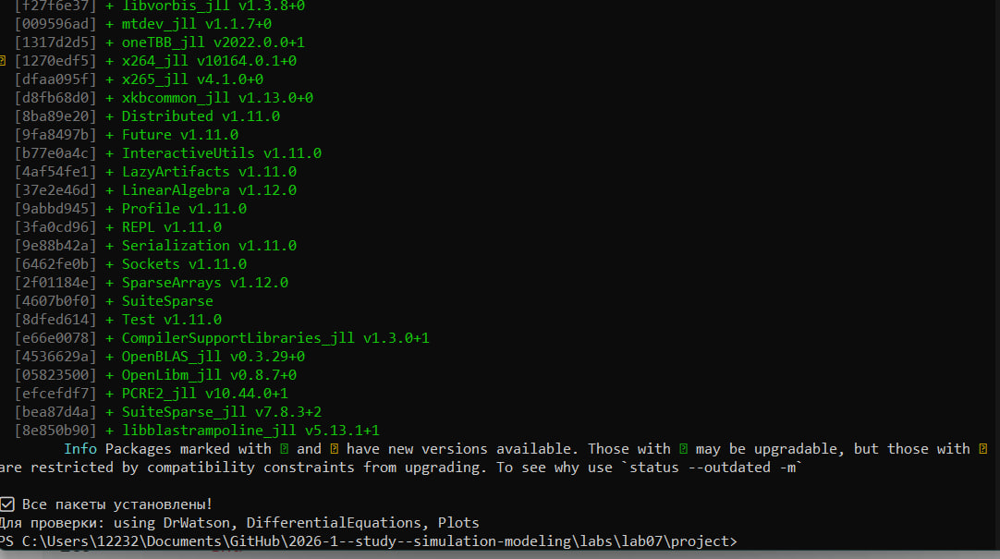
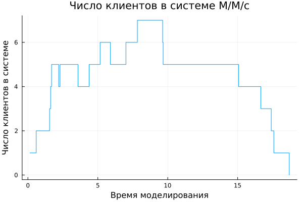
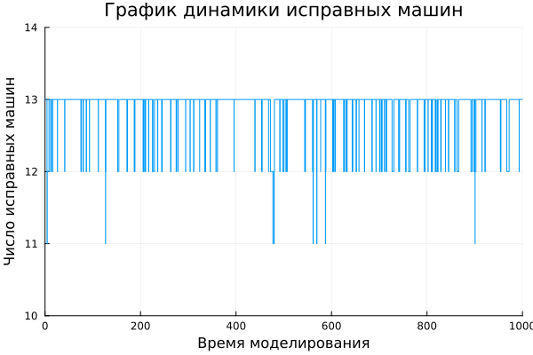
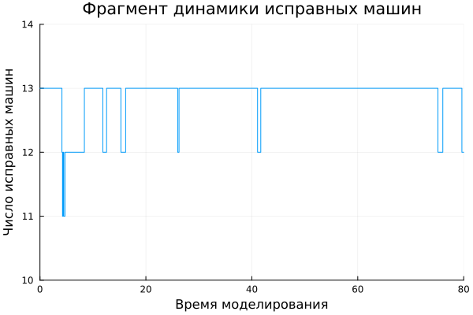
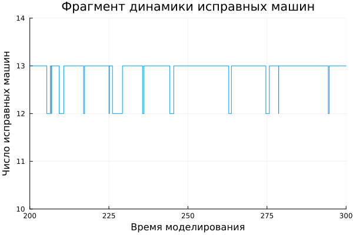
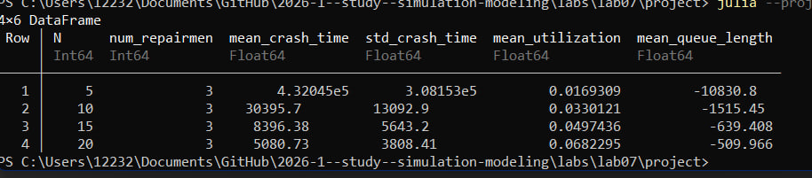

---
## Author
author:
  name: Чистов Даниил Максимович
  degrees: DSc
  orcid: 0000-0002-0877-7063
  email: 1132236021@rudn.ru
  affiliation:
    - name: Российский университет дружбы народов
      country: Российская Федерация
      postal-code: 117198
      city: Москва
      address: ул. Миклухо-Маклая, д. 6

## Title
title: "Лабораторная работа №7"
subtitle: "Имитационное моделирование"
license: "CC BY"
---

```{julia}
import Pkg
Pkg.activate("../project")
Pkg.instantiate()
```

# Цель работы

Целью данной работы является изучение моделей М/M/c и Росса, а также самостоятельная адаптация кодов моделей к структуре DrWatson, создание дополнительных графиков.

# Выполнение работы

## Предварительные работы

Перед началом работы с моделью создаю рабочее пространство для лабораторной работы ([рис. @fig-001]).

{#fig-001 width=70%}

## О модели М/M/c 

Модель M/M/c (по классификации Кендалла) — это система массового обслуживания со следующими свойствами:

* M (Markovian) — входящий поток заявок пуассоновский, интервалы между прибытиями распределены экспоненциально с параметром λ.
* M — время обслуживания каждой заявки распределено экспоненциально с параметром μ.
* c — количество идентичных обслуживающих приборов (каналов), работающих параллельно.

### Основные параметры

* Интенсивность входящего потока (λ): Среднее число заявок в единицу времени. Интервалы прибытия ~ Exp(1/λ)
* Интенсивность обслуживания (одного канала) (μ): Среднее число заявок, обслуживаемых одним прибором в единицу времени. Длительность обслуживания ~ Exp(1/μ)
* Число каналов (c): Количество параллельных серверов
* Загрузка системы на один канал (traffic intensity) (ρ = λ / (c·μ)): Условие стационарности: ρ < 1

По заданию требовалось полученный код перевести в структуру DrWatson - код был разделён на два - модель и базовый прогон.

Ниже предоставлен исходный код модели М/M/c, находящийся в папке /src:



Ниже представлен код базового прогона, создающий необходимые графики:



Код работает успешно, были получены следующие график - число клиентов в системе на протяжении всего прогона модели ([рис. @fig-002]).

{#fig-002 width=70%}

## О модели Росса

Модель представляет собой классический пример системы массового обслуживания с конечной популяцией, резервом и ремонтом.

### Постановка задачи

В системе находятся $N$ идентичных машин, которые постоянно работают и могут выходить из строя.

S машин находятся в резерве и готовы немедленно заменить любую отказавшую.

Одно ремонтное устройство (ремонтник), которое может одновременно ремонтировать только одну машину.

Когда работающая машина ломается, происходит следующее:

* Немедленно берётся одна резервная машина (если она есть) и запускается в работу вместо сломавшейся.
* Сломанная машина отправляется в ремонт.
* Если резерва нет, система падает (crash). Моделирование заканчивается.

После ремонта машина пополняет пул резервных (становится исправной и ждёт).

Требуется оценить среднее время до падения системы при заданных распределениях наработки до отказа и времени ремонта.

### Реализация в виде марковского процесса

Данная система может быть описана как марковский процесс с непрерывным временем и конечным числом состояний. Состояние можно определить как число работоспособных машин (работающих плюс резервных) или число машин в ремонте.

Пусть $k$ — число исправных машин, $0 <= k <= N + S$. Классический подход из учебника Росса: состояние — число исправных машин, а число работающих всегда равно $N$, если есть хотя бы $N$исправных.

Состояния:

* $i$ — число исправных машин, $i = 0, 1,..., N + S$.
* Число работающих машин всегда $min(N, i)$.
* Число резервных машин — $max(0, i - N)$.
* Число машин в ремонте — $N + S - i$.

Интенсивности переходов:

* При отказе машины (если есть работающая) число исправных машин уменьшается на 1. Интенсивность: $min(N, i)\lambda$ (если $i >= 1$).
* При завершении ремонта число исправных увеличивается на 1. Интенсивность: $\mu$, если есть хотя бы одна машина в ремонте (т.е. $i < N + S$). Ремонтник один, поэтому интенсивность постоянна, когда очередь на ремонт не пуста.

Система падает, когда число исправных машин $i = N - 1$ (если ещё есть работающая) или $i = N$. Падение происходит в момент отказа, когда нет резерва. Это соответствует переходу из состояния $N$ (0 резерва, все $N$ машин работают) в неработоспособное состояние. В момент отказа одной из $N$ машин при $i = N$запасных нет, следовательно, система падает. Значит, падение наступает при первом достижении состояния $i = N - 1$(при переходе $i = N$ => $N - 1$).

### Реализация модели на Julia

Для модели были заданы параметры по умолчанию следующим образом:

* $N=10$ — основные машины;
* $S=3$ — запасные машины;
* Наработка до отказа одной машины $~ exp(\lambda)$, где $\lambda = 100$ (среднее время безотказной работы 100 часов);
* Время ремонта $~ exp(\mu)$, где $\mu = 1$(среднее время ремонта 1 час).
* Машин много и они ломаются часто.
* Интенсивность отказов одной машины $1/100 = 0.01$, но так как их $N=10$, суммарная интенсивность отказов работающих машин равна $N * 0.01 = 0.1$отказов в час.
* Ремонт относительно медленный (1 час на ремонт), поэтому резерв быстро истощается.
* В среднем каждые 10 часов ломается одна машина, за это время ремонтник успевает починить 10 машин, но начальный запас всего 3.
* При случайных флуктуациях быстро возникает ситуация, когда резерв исчерпывается.
* Увеличив $S$ (число запасных), мы получаем значительно большее время падения.
* Например, $S=5$ может дать сотни часов.
* Это иллюстрирует важность резервирования.

По заданию требовалось полученный код перевести в структуру DrWatson - код был разделён на два - модель и базовый прогон.

Ниже предоставлен исходный код модели Росса, находящийся в папке /src:



Ниже представлен код базового прогона модели, было увеличено количество ремонтников, был произведён прогон по разному количеству машин ($N$), был проведён мониторинг загрузки ремонтника, средней длины очереди на ремонт, затем код создаёт графики изменения числа исправных машин во времени, а также несколько отрезков из этих графиков в увеличенном масштабе.



В результате были получены следующие графики:

График динамика числа исправных машин ([рис. @fig-003]).

{#fig-003 width=70%}

Следующие два графика аналогичны предыдущему, но был увеличен масштаб, чтобы детальнее рассмотреть динамику ([рис. @fig-004] - Начало), ([рис. @fig-005] - середина).

{#fig-004 width=70%}

{#fig-005 width=70%}

Также после работы кода была получена следующая статистика работы модели ([рис. @fig-006]).

{#fig-006 width=70%}

# Выводы

В результате выполнения данной лабораторной работы я укрепил свои знания в работе DrWatson, адаптировав полученный код к необходимому формату, а также получил навыки в работе с Julia, написав код для создания графиков и выполнения дополнительных заданий.

# Список литературы

[Лабораторная работа №7](https://esystem.rudn.ru/mod/resource/view.php?id=1356134)